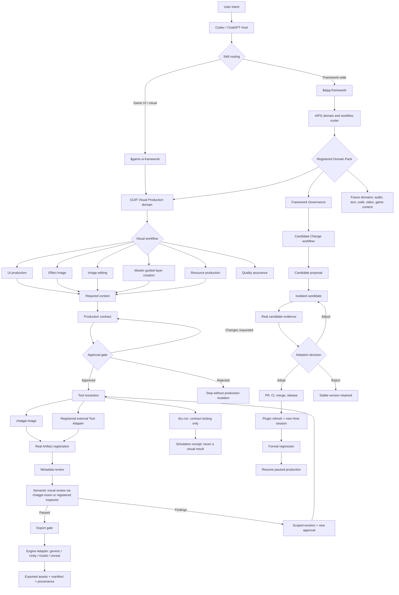
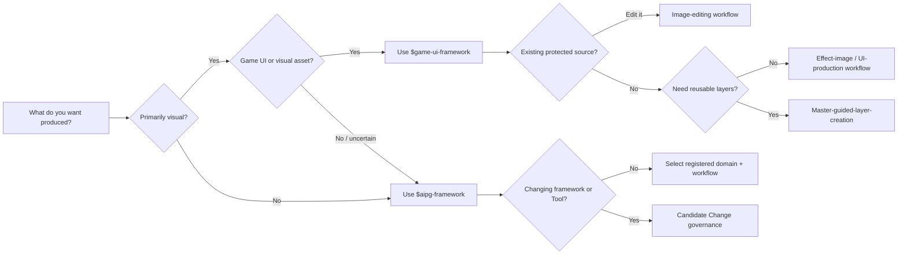
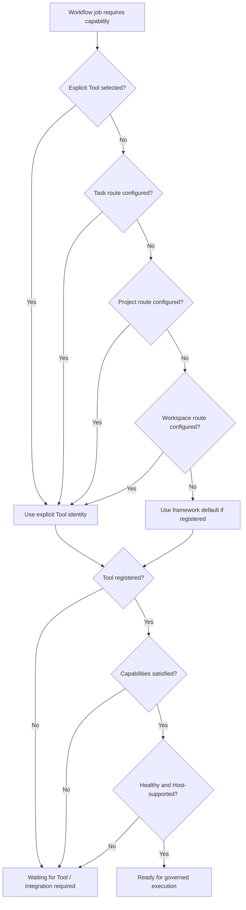
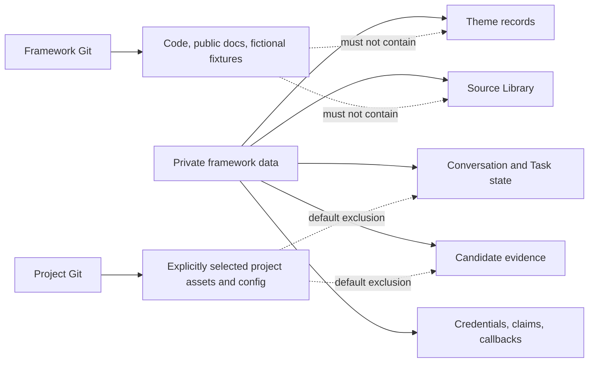
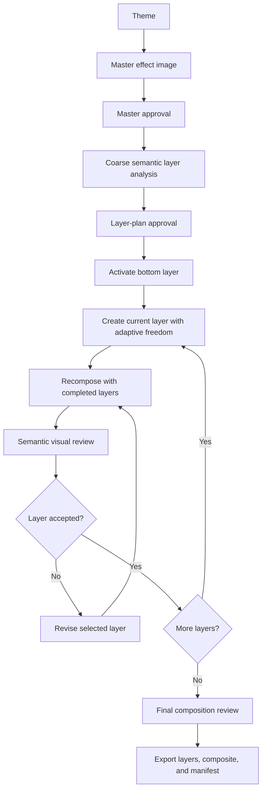
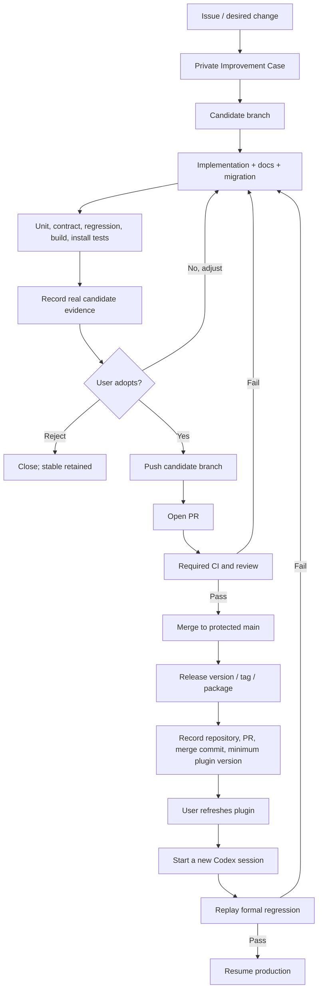

# AIPG User Blueprint

> A detailed usage map for AIPG — AI Production & Governance Framework  
> Document version: `1.1.0-beta.1`
> Applies to: AIPG Core, GUIF Visual Production, Codex Skills, Host/Tool
> routing, Artifact governance, versioning, publication, recovery, and export

## 1. How to read this blueprint

This document is for four audiences:

| Audience | Start here | Primary concern |
| --- | --- | --- |
| Production user | Sections 2, 3, 11 | What to ask for and when approval is needed |
| Art or UI user | Sections 5, 8, 11.2–11.4 | Theme, master image, layers, visual review, export |
| Project owner | Sections 6, 7, 9, 10 | Tools, privacy, evidence, recovery, release governance |
| Framework developer | Sections 4, 6, 9, 12, 13 | Domain Packs, Workflow v3, adapters, compatibility |

The name is **AIPG**, not AIGP:

- **AIPG**: the domain-neutral AI Production & Governance Framework.
- **GUIF**: the game UI and visual-production domain inside AIPG.

## 2. The complete map



The map has three non-negotiable boundaries:

1. A Skill decides and governs work; it does not fabricate Tool output.
2. A Tool creates or inspects the real result; metadata alone cannot prove
   semantic quality.
3. A candidate cannot become stable merely because code exists; publication,
   refresh, and regression remain separate states.

## 3. The user-facing entry map

Users normally describe the desired outcome in natural language. They should
not need to manage Task IDs, leases, callback IDs, private paths, credentials,
or low-level runtime commands.



### Recommended natural-language entry prompts

| Intent | Example user request | Expected routing |
| --- | --- | --- |
| General production | “Use AIPG to plan and govern this production task.” | `$aipg-framework` |
| Game UI creation | “Use GUIF to design a sci-fi shop screen.” | `$game-ui-framework` |
| Existing-image edit | “Use GUIF to edit this registered source without changing the character.” | GUIF image editing |
| Layered creation | “Use the master as style/layout guidance and create assets bottom to top.” | Master-guided layer creation |
| Tool integration | “Integrate a layout Tool for editable UI structure.” | AIPG Tool Integration Candidate |
| Framework evolution | “Turn this workflow into a reusable domain workflow.” | AIPG Candidate Change |
| Export | “Export the approved assets for Unity.” | GUIF export gate + Unity adapter |

## 4. Responsibility model

### 4.1 AIPG Core

AIPG Core owns domain-neutral governance:

- intent and domain routing;
- Workflow loading and validation;
- task state and checkpoints;
- approval gates;
- Artifact identity and lineage;
- protected Source policy;
- Tool discovery and routing;
- deterministic QA boundaries;
- semantic-review requirements;
- revision scope;
- Candidate Change;
- adoption and publication records;
- recovery and gated export.

AIPG Core does **not** need to understand:

- buttons, panels, visual hierarchy, image alpha, or Theme semantics;
- how a model creates pixels;
- how Unity imports a sprite;
- how an audio, text, code, or video domain evaluates quality.

Those belong to Domain Packs, Tools, inspectors, and exporters.

### 4.2 Domain Pack

A Domain Pack defines production-specific behavior.

| Field | Meaning |
| --- | --- |
| Domain ID | Stable routing identity |
| Workflows | Workflows registered by the domain |
| Context types | Theme, master, source, requirements, or domain data |
| Artifact kinds | Domain-specific output types |
| Review criteria | What deterministic and semantic review must evaluate |
| Tool capabilities | Capabilities required from Tool Adapters |
| Export adapters | Supported delivery targets |
| Compatibility names | Previous names retained during migration |

Current built-in Domain Packs:

| Domain | Status | Workflows |
| --- | --- | --- |
| `framework-governance` | Implemented | Framework evolution and Candidate Change |
| `visual-production` | Implemented as GUIF | Planning, UI production, effect image, Theme direction, resources, QA, master-guided layers |
| Audio | Not implemented | Requires a future Domain Pack |
| Text / narrative | Not implemented | Requires a future Domain Pack |
| Code production | Not implemented | Requires a future Domain Pack |
| Video | Not implemented | Requires a future Domain Pack |
| Game content | Not implemented | Requires a future Domain Pack |

“Future domain” means architecturally allowed, not currently available.

### 4.3 Workflow

A Workflow is a declared production route. It determines:

- required context;
- ordered stages;
- participating agents;
- approval points;
- constraint policy;
- capability requirements;
- review requirements;
- revision behavior;
- export prerequisites.

Workflow Manifest v3 fields:

| Field | Required | Purpose |
| --- | --- | --- |
| `schema_version` | Yes | Manifest contract version |
| `id` | Yes | Stable workflow identity |
| `name` | Yes | Human-readable name |
| `domain` | Yes | Owning Domain Pack |
| `manager` | Yes | Coordinating role |
| `agents` | Yes | Executing agent sequence |
| `steps` | Yes | Human-readable production steps |
| `requires` | Yes | Required context types |
| `stages` | Yes | Governed lifecycle stages |
| `creation_direction` | Yes | Ordered or unordered production |
| `constraint_policy` | Yes | Hard/soft constraint semantics |

Schema v1 and v2 remain readable for compatibility.

### 4.4 Skill

A Skill is the natural-language operating policy used by Codex. It:

- recognizes user intent;
- chooses a Domain and Workflow;
- translates user language into governed contracts;
- presents approval decisions;
- calls framework operations internally;
- invokes real Host capabilities when authorized;
- reports only safe user-facing state.

A Skill must not:

- fabricate a Tool result;
- hide a required source-registration choice;
- claim a dry run generated real media;
- expose private runtime identifiers or paths;
- treat metadata as semantic review;
- merge or publish a candidate without the required adoption state.

### 4.5 Host

The Host is the active operator environment. In the current implementation,
ChatGPT / Codex is the default Host.

Host responsibilities:

- understand natural-language intent;
- access configured capabilities;
- perform real Tool handoffs;
- return real files or structured findings;
- keep credentials and private attachments outside Project Git;
- never claim an unavailable capability ran successfully.

### 4.6 Tool

A Tool performs a concrete capability. Tool identity and capability are
different:

- `chatgpt-image` is a Tool identity.
- `image-generation`, `image-editing`, and `transparent-output` are
  capabilities.

One Tool can provide multiple capabilities; one Workflow can require several
capabilities.

### 4.7 Artifact

An Artifact is a registered result with identity and lineage. Registration does
not mean approval.

Typical Artifact states:

```text
real file returned
-> registered
-> metadata reviewed
-> semantic review pending
-> passed or findings
-> active or superseded
-> export eligible or blocked
```

### 4.8 Engine Adapter

An Engine Adapter translates approved production assets into a delivery target.
It is not the image-generation Tool.

Current adapters:

- `generic`;
- `unity`;
- `godot`;
- `unreal`.

## 5. Skill map

### 5.1 `$aipg-framework`

Use for:

- domain-neutral routing;
- creating or registering a new Domain Pack;
- registering Workflow v3;
- production governance outside visual-specific details;
- Candidate Change;
- Tool integration;
- provider routing;
- version migration;
- publication, refresh, regression, and recovery.

Do not use it as a substitute for a domain Skill when specialized production
rules already exist.

### 5.2 `$game-ui-framework`

Use for:

- game UI and visual interface production;
- private Theme lifecycle;
- master and source registration;
- image generation and editing;
- protected-region editing;
- effect images;
- master-guided layers;
- visual QA;
- revision;
- game-engine asset export.

It is the GUIF compatibility entry and the visual-production Skill of AIPG.

### 5.3 Skill selection precedence

| Situation | Primary Skill | Secondary behavior |
| --- | --- | --- |
| General or unknown domain | `$aipg-framework` | Route to a registered Domain Pack |
| Game UI request | `$game-ui-framework` | Use AIPG governance underneath |
| Visual workflow defect | `$game-ui-framework` | Open AIPG Candidate Change |
| Framework-wide defect | `$aipg-framework` | Diagnose affected layers |
| New Tool for visual layout | `$aipg-framework` + GUIF context | Integrate only the required capability |
| Existing GUIF project | `$game-ui-framework` | Preserve compatibility contracts |

### 5.4 Adding a future Skill

A new Domain Skill must declare:

1. trigger conditions;
2. Domain Pack ID;
3. supported Workflows;
4. required context;
5. approval behavior;
6. Tool capability mapping;
7. truthful completion criteria;
8. privacy rules;
9. Artifact and lineage policy;
10. revision and export policy;
11. Candidate Change behavior;
12. public fictional regression fixtures.

## 6. Tool and capability map

### 6.1 Current registered production Tools

| Tool | Capabilities | Execution | Production | External call | Credentials |
| --- | --- | --- | --- | --- | --- |
| `chatgpt-image` | Image generation, image editing, protected-region editing, transparent output | Host external callback | Allowed | Yes | Uses Host support; no separate framework credential |
| `dry-run` | Deterministic contract simulation for image jobs | Direct | Not allowed as real production | No | No |

### 6.2 Current semantic inspector

| Inspector | Capability | Result |
| --- | --- | --- |
| `chatgpt-vision` | Real semantic visual inspection through Host submission | Structured status, summary, findings |

An inspector result must come from inspection of the actual Artifact. A
filename, MIME type, width, height, or checksum cannot establish composition,
readability, Theme consistency, usability, or visual quality.

### 6.3 Tool resolution order



Resolution precedence is:

```text
explicit
> Task
> Project
> Workspace
> framework default
```

A candidate Tool trial uses a Task-only override. It must not silently mutate
Project or Workspace routing.

### 6.4 Tool readiness disclosure

Before an unfamiliar Tool is adopted, the user should see:

- registration status;
- availability;
- health;
- required capabilities;
- supported Host;
- permissions;
- input and output data scope;
- external calls;
- billing status when known;
- credential requirements;
- failure and retry behavior;
- adoption scope.

### 6.5 Unavailable Tools

An unavailable Tool has three legitimate outcomes:

1. Bind another registered healthy Tool.
2. Open a Tool Integration Candidate and build an Adapter.
3. Cancel the production step.

“Pretend the Tool ran” is never a valid outcome.

### 6.6 Tool Adapter contract

A production Tool Adapter needs:

- stable Tool ID and version;
- capability manifest;
- permissions and data scopes;
- Host support declaration;
- health check;
- execution mode;
- real result callback or direct result contract;
- Artifact registration;
- failure recovery;
- contract tests;
- production-allowed policy;
- truthful simulation marker.

### 6.7 Image Tool versus layout Tool

A raster Tool and a structured-layout Tool solve different problems:

| Need | Appropriate capability |
| --- | --- |
| Painted background or illustration | Raster image generation |
| Pixel-level edit | Image editing |
| Transparent layer asset | Transparent image output |
| Structured UI hierarchy | Structured layout Tool |
| Editable component library | Design-system / component Tool |
| Visual semantic judgment | Visual inspector |
| Unity import and hierarchy | Engine Adapter |

Selecting a structured layout Tool must not automatically replace raster image
generation.

## 7. Data, privacy, and lineage map



### Storage rules

| Data | Default storage | Public Git allowed? |
| --- | --- | --- |
| Framework source and public docs | Framework Git | Yes |
| Fictional tests and fixtures | Framework Git | Yes |
| Real Theme content | Private framework data | No |
| Uploaded or conversation images | Private Source Library | No |
| Prompts and decisions | Private framework data | No |
| Credentials and tokens | Private framework data | No |
| Candidate evidence | Private framework data | No |
| Exported project asset | User-selected Project location | Only after explicit selection |
| Public regression image | Framework Git | Only if wholly fictional |

### Source roles

| Source usage | Meaning |
| --- | --- |
| `editable-source` | Authorized source for protected editing |
| `theme-reference` | Visual direction reference |
| `master-reference` | Master guidance for composition and style |

An unregistered image cannot silently become a protected GUIF edit source.

### Artifact lineage

Every real Artifact should identify:

- source Task and job;
- Tool identity and model identity when available;
- input references;
- output contract;
- approval snapshot;
- file identity;
- simulation and visual flags;
- QA state;
- supersession relationship;
- export relationship.

## 8. GUIF visual workflow map

### 8.1 Standard UI production

```text
Theme/context
-> requirement
-> structured plan
-> art direction
-> resource contract
-> model-neutral Prompt IR
-> approval
-> real image production
-> metadata + semantic review
-> revision when needed
-> export
```

Use when the desired output is an interface or visual asset set but does not
require the master-guided bottom-to-top method.

### 8.2 Existing-image editing

```text
actual image
-> source-registration decision
-> editable-source registration
-> protected edit contract
-> edit approval
-> real image edit
-> protected-pixel check
-> semantic review
-> replacement / supersession
```

Initial generation approval does not authorize later editing. Every revision
has its own approval.

### 8.3 Master-guided layer creation



The master policy is:

```json
{
  "role": "style-and-layout-guidance",
  "pixel_matching": false,
  "layout_anchors": "preserve",
  "style_intent": "preserve",
  "creative_interpretation": "allowed"
}
```

Hard constraints:

- functional role;
- major layout anchors;
- independent asset boundary;
- required text or information;
- protected content;
- transparency and canvas contract;
- interaction-state requirements.

Soft guidance:

- shape details;
- materials;
- texture;
- lighting;
- decoration;
- local color interpretation;
- visual response to completed layers.

Creative freedom:

| Level | Typical layers |
| --- | --- |
| Low | Brand marks, key controls, critical information |
| Medium | Panels, frames, icons, secondary controls |
| High | Backgrounds, atmosphere, decorative effects, foreground particles |

Revising layer N:

- preserves approved protected layers below N;
- invalidates layer N;
- invalidates downstream composites and dependent layers;
- requires a new semantic review;
- does not authorize unrelated edits.

### 8.4 Visual assurance ladder

| Level | Can establish | Cannot establish |
| --- | --- | --- |
| File validation | File exists, readable format | Visual correctness |
| Metadata QA | Dimensions, MIME type, alpha declaration, naming | Composition or quality |
| Pixel QA | Protected pixels unchanged within tolerance | Theme or usability |
| Contract QA | Required structured fields and approvals exist | Actual model output quality |
| Semantic visual review | Composition, readability, Theme consistency, visual findings | User preference without user confirmation |
| User approval | Subjective acceptance and authorization | Tool execution that never happened |

## 9. Approval and governance map

### 9.1 Production approvals

| Gate | Authorizes | Does not authorize |
| --- | --- | --- |
| Plan approval | Execute the approved initial plan | Future revisions |
| Layer-plan approval | Execute listed layers in order | Unlisted assets or major layout changes |
| Revision approval | Apply the specified scoped edit | Other layers or protected regions |
| Final visual approval | Mark reviewed composition acceptable | Export to every target |
| Export approval/request | Materialize approved assets for target | Framework publication |

### 9.2 Candidate Change approvals

Candidate governance has two independent decisions:

```text
proposal
-> candidate-build authorization
-> isolated implementation
-> real evidence
-> adoption decision
-> publication
```

| Decision | Meaning |
| --- | --- |
| Build candidate | May implement and validate in isolation |
| Request changes | Return to candidate building |
| Reject candidate | Keep stable system |
| Adopt candidate | Authorize publication workflow |

Adoption is valid only after real candidate evidence exists.

### 9.3 Change classification

| Change type | Use when |
| --- | --- |
| `skill-change` | Natural-language operating policy is wrong or incomplete |
| `framework-change` | Core domain-neutral behavior must change |
| `workflow-change` | Stage order, gates, or required context must change |
| `multi-layer-change` | Several framework layers change together |
| `theme-policy-change` | Theme storage, binding, or application rules change |
| `provider-routing-change` | Legacy/provider selection behavior changes |
| `tool-change` | Switch to an already registered available Tool |
| `tool-integration-change` | New or unsupported Tool needs an Adapter |

Diagnosis should consider all affected layers before selecting a type.

## 10. Version governance

AIPG has several version axes. They must not be collapsed into one number.

### 10.1 Version axes

| Version | Example | Governs |
| --- | --- | --- |
| Plugin version | `1.1.0-beta.1` | Installed Codex plugin snapshot |
| Candidate plugin version | `1.2.0-candidate.1` | Example isolated pre-adoption build |
| Python package version | `1.1.0b1` | `aipg-framework` distribution |
| Public API version | `1` | Compatibility surface |
| Workflow schema | `3` | Workflow manifest structure |
| Artifact schema | `1` | Artifact record structure |
| Task schema | `2`, `3` | Persisted Task compatibility |
| Theme version | Immutable integer version | User-owned Theme evolution |
| Tool manifest version | Tool-specific, e.g. `1.0` | Adapter capability declaration |
| Domain Pack schema | `1` | Domain registry contract |

### 10.2 Semantic versioning policy

| Change | Version impact |
| --- | --- |
| Documentation clarification only | Patch or no runtime version change |
| Backward-compatible workflow/Tool capability | Minor |
| New Domain Pack | Minor |
| New optional Workflow v3 | Minor |
| Bug fix without contract change | Patch |
| Plugin packaging correction | Patch |
| Breaking public API or persisted schema | Major or new public API version |
| Candidate iteration | Candidate suffix only until adoption |

Prerelease identifiers do not make a breaking change safe. Compatibility still
requires an explicit migration path.

### 10.3 Compatibility rules

AIPG 1.x currently preserves:

- `guif` Python import;
- `guif` CLI alias;
- `$game-ui-framework`;
- existing GUIF private-data environment variables;
- Workflow schema v1 and v2;
- existing Theme, Source, Artifact, Task, and Candidate records within declared
  supported schemas;
- explicit Legacy ProviderAdapter compatibility.

New domain-neutral integrations should use `aipg`; visual integrations may use
`guif`.

### 10.4 Release governance



### 10.5 Required release records

A published framework change records:

- repository;
- branch;
- pull request;
- merge commit;
- released version;
- minimum plugin version;
- build and test outcome;
- migration notes;
- refresh requirement;
- formal regression outcome.

### 10.6 Version-file maintenance checklist

When a release changes version or identity, inspect and update:

- `.codex-plugin/plugin.json`;
- repository marketplace metadata;
- `pyproject.toml`;
- `aipg` and `guif` package version exposure;
- CI version assertions;
- README and Chinese README;
- CHANGELOG;
- candidate/release notes;
- architecture and migration documents;
- plugin Skills and their user-facing refresh name;
- package provenance expectations;
- tests that assert plugin/package identity.

Historical release notes should remain historically accurate rather than being
mechanically rewritten.

## 11. End-to-end user journeys

### 11.1 General governed production

1. User describes the outcome.
2. `$aipg-framework` identifies the Domain.
3. AIPG selects or requests a Workflow.
4. The Workflow declares required context.
5. Missing context is requested without exposing runtime internals.
6. A production contract is presented.
7. User approves, requests changes, or rejects.
8. Tool resolution verifies capability and health.
9. Real results become registered Artifacts.
10. Required review runs at the correct assurance level.
11. Revisions receive independent approval.
12. Export occurs only when the gate passes.

### 11.2 Create one game UI effect image

Suggested request:

> Use GUIF to create a fictional sci-fi inventory screen. Confirm the Theme and
> plan before generating.

Expected route:

```text
$game-ui-framework
-> visual-production
-> effect-image or ui-production
-> Theme
-> plan approval
-> chatgpt-image
-> Artifact
-> chatgpt-vision
-> final approval
-> optional export
```

### 11.3 Create a layered game UI

Suggested request:

> Use the approved master as style and layout guidance. Analyze coarse layers,
> let AI creatively interpret soft details, then produce from background to
> foreground and export independent assets.

Expected route:

```text
$game-ui-framework
-> master-guided-layer-creation
-> Theme + master-reference
-> master approval
-> layer-plan approval
-> background
-> current composite
-> container/frame
-> current composite
-> controls/content
-> current composite
-> decoration/effects
-> final semantic review
-> layer manifest + engine export
```

### 11.4 Edit an existing image safely

1. GUIF checks whether the image is registered.
2. If not, the user chooses:
   - editable source;
   - Theme reference;
   - master reference;
   - leave the formal chain.
3. Editable-source registration creates immutable lineage.
4. The edit plan identifies protected regions.
5. User approves the edit.
6. Real editing occurs.
7. Protected pixels and semantic quality are reviewed.
8. A passing replacement may supersede the source.

### 11.5 Add a new Tool

Suggested request:

> Add a structured layout Tool for GUIF component hierarchy, but keep raster
> generation on the current image Tool.

Expected route:

```text
$aipg-framework
-> capability analysis
-> Tool discovery
-> registered and healthy?
   -> yes: Task-only Tool trial
   -> no: Tool Integration Candidate
-> permissions/data/billing/credentials disclosure
-> Adapter contract
-> real result
-> adoption scope
```

### 11.6 Improve AIPG itself

1. Identify observed and expected behavior.
2. Diagnose Skill, Workflow, Core, Tool, Theme policy, Prompt IR, review, and
   export layers.
3. Open one Improvement Case.
4. Preserve the production checkpoint.
5. Build on an isolated source branch.
6. Use fictional public fixtures.
7. Run real tests and record evidence.
8. Adopt, adjust, or reject.
9. After adoption, publish through PR and CI.
10. Refresh the plugin and run formal regression.

## 12. Recovery and failure map

| Failure | User-visible outcome | Correct recovery |
| --- | --- | --- |
| Missing Theme required by GUIF | Theme confirmation | Select, create, derive, or explicitly continue unbound if allowed |
| Missing registered source | Source import required | User chooses source usage |
| Tool not registered | Waiting for Tool | Bind, integrate, or cancel |
| Tool unhealthy | Waiting for Tool | Retry health, select another Tool, or integrate |
| External callback interrupted | Recoverable error | Recover or retry persisted work |
| Semantic findings | Revision required | Create scoped revision and approve separately |
| Candidate failed | Candidate building | Adjust candidate; stable remains unchanged |
| Plugin published but old session active | Plugin refresh required | Refresh plugin and start new session |
| Formal regression failed | Candidate reopened | Fix and republish; do not resume production |
| Export gate blocked | Export denied | Resolve approvals, QA, lineage, or missing Artifacts |

Recovery must use persisted checkpoints. It must not invent completed work or
duplicate external operations blindly.

## 13. Extension blueprint

### 13.1 Adding a Domain Pack

Required deliverables:

- stable Domain ID;
- Domain Pack schema;
- user-facing Skill or routing rules;
- Workflow manifests;
- domain context schemas;
- Artifact kinds;
- Tool capabilities and adapters;
- deterministic QA;
- semantic inspector contract;
- revision policy;
- exporter;
- privacy policy;
- fictional fixtures;
- migration and version notes;
- failure recovery tests.

### 13.2 Adding a Workflow

Checklist:

1. Identify Domain ownership.
2. Define user intent and non-goals.
3. Define required context.
4. Define ordered stages.
5. Define hard and soft constraints.
6. Define approval gates.
7. Define Tool capabilities.
8. Define Artifact outputs.
9. Define deterministic and semantic review.
10. Define revision invalidation.
11. Define export prerequisites.
12. Add Workflow v3 manifest.
13. Add fictional tests.
14. Update Domain registry, README, CHANGELOG, and migration notes.

### 13.3 Adding an Engine Adapter

An Engine Adapter should:

- accept only export-eligible Artifacts;
- preserve Artifact and manifest identity;
- map dimensions, alpha, pivot, slicing, hierarchy, states, materials, and
  target settings where supported;
- report exactly what was written;
- fail safely without claiming engine import succeeded;
- support rollback or provide a clear non-rollback boundary.

### 13.4 Adding an inspector

An inspector contract needs:

- stable inspector identity;
- supported media and criteria;
- permission and data-scope disclosure;
- actual Artifact attachment;
- structured status, summary, and findings;
- no metadata-only semantic pass;
- retry and failure behavior;
- tests using fictional media.

## 14. Operational checklists

### Before production

- [ ] Correct Domain and Workflow selected.
- [ ] Required context is present.
- [ ] Real source usage is registered.
- [ ] Tool capabilities are available and healthy.
- [ ] Permissions, data flow, credentials, and billing are understood.
- [ ] Production contract is complete.
- [ ] Required approval is recorded.

### Before accepting an Artifact

- [ ] Result file is real and registered.
- [ ] Tool and model identity are truthful.
- [ ] Simulation flag is false for production.
- [ ] References and lineage are valid.
- [ ] Metadata QA passed.
- [ ] Protected-pixel QA passed when applicable.
- [ ] Semantic review used the real Artifact.
- [ ] User confirmed subjective acceptance when required.

### Before export

- [ ] Active Artifacts are approved.
- [ ] No blocking visual findings remain.
- [ ] Required layer dependencies are complete.
- [ ] Composition manifest is valid.
- [ ] Target Engine Adapter is supported.
- [ ] Export destination and overwrite policy are explicit.
- [ ] Rollback boundary is understood.

### Before adopting a framework change

- [ ] Stable baseline recorded where practical.
- [ ] Candidate branch and version linked.
- [ ] Real candidate evidence recorded.
- [ ] No user-private data entered public Git.
- [ ] Backward compatibility assessed.
- [ ] README, CHANGELOG, migration, manifests, and tests updated.
- [ ] User has reviewed the candidate result.
- [ ] Adoption decision is explicit.

### Before publication

- [ ] Adoption state authorizes publication.
- [ ] Branch is pushed.
- [ ] PR is open with migration and evidence summary.
- [ ] Required CI passes.
- [ ] Review issues are resolved.
- [ ] Main is protected from unreviewed changes.
- [ ] Release version is consistent across files.
- [ ] Repository, PR, merge commit, and minimum plugin version are recorded.
- [ ] Plugin refresh and new-session requirement is communicated.
- [ ] Formal regression plan is ready.

## 15. Quick-reference matrix

| User asks for | Skill | Domain | Workflow / process | Primary Tool or adapter | Key gate |
| --- | --- | --- | --- | --- | --- |
| General AI production | `$aipg-framework` | Routed | Registered Workflow | Capability-dependent | Plan approval |
| Game UI design | `$game-ui-framework` | Visual | UI production | `chatgpt-image` | Production approval |
| One effect image | `$game-ui-framework` | Visual | Effect image | `chatgpt-image` | Visual review |
| Protected image edit | `$game-ui-framework` | Visual | Image editing | `chatgpt-image` | Source + revision approval |
| Layered UI assets | `$game-ui-framework` | Visual | Master-guided layers | `chatgpt-image` + inspector | Layer-plan + final approval |
| Visual inspection | `$game-ui-framework` | Visual | QA | `chatgpt-vision` | Real Artifact required |
| Unity output | `$game-ui-framework` | Visual | Export | Unity Engine Adapter | Export gate |
| Contract-only test | Developer/operator | Any supported | Existing Workflow | `dry-run` | Never treated as production |
| Change Tool route | `$aipg-framework` | Governance | Tool Change | Registered Tool | Evidence + adoption scope |
| Integrate new Tool | `$aipg-framework` | Governance | Tool Integration Candidate | New Adapter | Adoption |
| Change framework | `$aipg-framework` | Governance | Candidate Change | Source repository | Adoption + publication |

## 16. Golden rules

1. Route by Domain and Workflow before asking for domain-specific context.
2. Theme belongs to GUIF, not the AIPG top level.
3. Skill governs; Tool executes; Artifact records; review evaluates.
4. Tool identity is not the same as capability.
5. Dry run is never a real media result.
6. Metadata is never semantic review.
7. Every revision has its own scope and approval.
8. Real sources and evidence remain private by default.
9. A candidate does not alter stable production.
10. Adoption, publication, plugin refresh, and formal regression are separate
    states.
11. Backward compatibility requires explicit contracts and migration.
12. If a capability is unavailable, stop truthfully or integrate it—never
    fabricate success.
