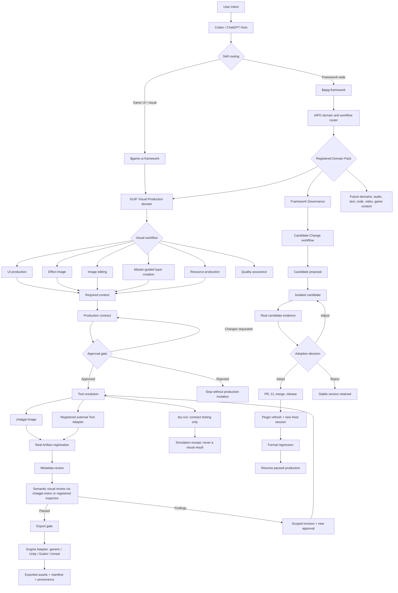
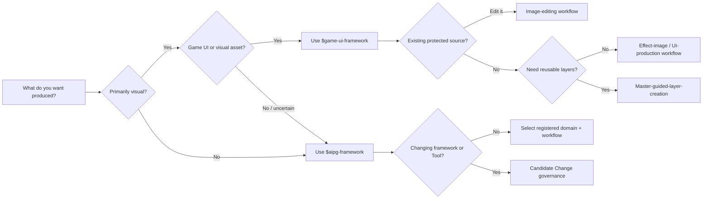
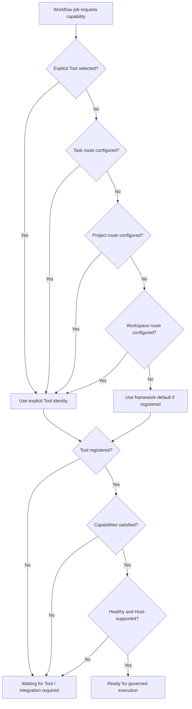

# AIPG User Blueprint

> A detailed usage map for AIPG — AI Production & Governance Framework  
> Document version: `1.1.0-beta.1-candidate.2`  
> Applies to: AIPG Core, GUIF Visual Production, Codex Skills, Host/Tool
> routing, Artifact governance, versioning, publication, recovery, and export

## 1. How to read this blueprint

This document is for four audiences:

| Audience | Start here | Primary concern |
| --- | --- | --- |
| Production user | Sections 2, 3, 11 | What to ask for and when approval is needed |
| Art or UI user | Sections 5, 8, 11.2–11.4 | Theme, master image, layers, visual review, export |
| Project owner | Sections 6, 7, 9, 10 | Tools, privacy, evidence, recovery, release governance |
| Framework developer | Sections 4, 6, 9, 12, 13 | Domain Packs, Workflow v3, adapters, compatibility |

The name is **AIPG**, not AIGP:

- **AIPG**: the domain-neutral AI Production & Governance Framework.
- **GUIF**: the game UI and visual-production domain inside AIPG.

## 2. The complete map



The map has three non-negotiable boundaries:

1. A Skill decides and governs work; it does not fabricate Tool output.
2. A Tool creates or inspects the real result; metadata alone cannot prove
   semantic quality.
3. A candidate cannot become stable merely because code exists; publication,
   refresh, and regression remain separate states.

## 3. The user-facing entry map

Users normally describe the desired outcome in natural language. They should
not need to manage Task IDs, leases, callback IDs, private paths, credentials,
or low-level runtime commands.



### Recommended natural-language entry prompts

| Intent | Example user request | Expected routing |
| --- | --- | --- |
| General production | “Use AIPG to plan and govern this production task.” | `$aipg-framework` |
| Game UI creation | “Use GUIF to design a sci-fi shop screen.” | `$game-ui-framework` |
| Existing-image edit | “Use GUIF to edit this registered source without changing the character.” | GUIF image editing |
| Layered creation | “Use the master as style/layout guidance and create assets bottom to top.” | Master-guided layer creation |
| Tool integration | “Integrate a layout Tool for editable UI structure.” | AIPG Tool Integration Candidate |
| Framework evolution | “Turn this workflow into a reusable domain workflow.” | AIPG Candidate Change |
| Export | “Export the approved assets for Unity.” | GUIF export gate + Unity adapter |

## 4. Responsibility model

### 4.1 AIPG Core

AIPG Core owns domain-neutral governance:

- intent and domain routing;
- Workflow loading and validation;
- task state and checkpoints;
- approval gates;
- Artifact identity and lineage;
- protected Source policy;
- Tool discovery and routing;
- deterministic QA boundaries;
- semantic-review requirements;
- revision scope;
- Candidate Change;
- adoption and publication records;
- recovery and gated export.

AIPG Core does **not** need to understand:

- buttons, panels, visual hierarchy, image alpha, or Theme semantics;
- how a model creates pixels;
- how Unity imports a sprite;
- how an audio, text, code, or video domain evaluates quality.

Those belong to Domain Packs, Tools, inspectors, and exporters.

### 4.2 Domain Pack

A Domain Pack defines production-specific behavior.

| Field | Meaning |
| --- | --- |
| Domain ID | Stable routing identity |
| Workflows | Workflows registered by the domain |
| Context types | Theme, master, source, requirements, or domain data |
| Artifact kinds | Domain-specific output types |
| Review criteria | What deterministic and semantic review must evaluate |
| Tool capabilities | Capabilities required from Tool Adapters |
| Export adapters | Supported delivery targets |
| Compatibility names | Previous names retained during migration |

Current built-in Domain Packs:

| Domain | Status | Workflows |
| --- | --- | --- |
| `framework-governance` | Implemented | Framework evolution and Candidate Change |
| `visual-production` | Implemented as GUIF | Planning, UI production, effect image, Theme direction, resources, QA, master-guided layers |
| Audio | Not implemented | Requires a future Domain Pack |
| Text / narrative | Not implemented | Requires a future Domain Pack |
| Code production | Not implemented | Requires a future Domain Pack |
| Video | Not implemented | Requires a future Domain Pack |
| Game content | Not implemented | Requires a future Domain Pack |

“Future domain” means architecturally allowed, not currently available.

### 4.3 Workflow

A Workflow is a declared production route. It determines:

- required context;
- ordered stages;
- participating agents;
- approval points;
- constraint policy;
- capability requirements;
- review requirements;
- revision behavior;
- export prerequisites.

Workflow Manifest v3 fields:

| Field | Required | Purpose |
| --- | --- | --- |
| `schema_version` | Yes | Manifest contract version |
| `id` | Yes | Stable workflow identity |
| `name` | Yes | Human-readable name |
| `domain` | Yes | Owning Domain Pack |
| `manager` | Yes | Coordinating role |
| `agents` | Yes | Executing agent sequence |
| `steps` | Yes | Human-readable production steps |
| `requires` | Yes | Required context types |
| `stages` | Yes | Governed lifecycle stages |
| `creation_direction` | Yes | Ordered or unordered production |
| `constraint_policy` | Yes | Hard/soft constraint semantics |

Schema v1 and v2 remain readable for compatibility.

### 4.4 Skill

A Skill is the natural-language operating policy used by Codex. It:

- recognizes user intent;
- chooses a Domain and Workflow;
- translates user language into governed contracts;
- presents approval decisions;
- calls framework operations internally;
- invokes real Host capabilities when authorized;
- reports only safe user-facing state.

A Skill must not:

- fabricate a Tool result;
- hide a required source-registration choice;
- claim a dry run generated real media;
- expose private runtime identifiers or paths;
- treat metadata as semantic review;
- merge or publish a candidate without the required adoption state.

### 4.5 Host

The Host is the active operator environment. In the current implementation,
ChatGPT / Codex is the default Host.

Host responsibilities:

- understand natural-language intent;
- access configured capabilities;
- perform real Tool handoffs;
- return real files or structured findings;
- keep credentials and private attachments outside Project Git;
- never claim an unavailable capability ran successfully.

### 4.6 Tool

A Tool performs a concrete capability. Tool identity and capability are
different:

- `chatgpt-image` is a Tool identity.
- `image-generation`, `image-editing`, and `transparent-output` are
  capabilities.

One Tool can provide multiple capabilities; one Workflow can require several
capabilities.

### 4.7 Artifact

An Artifact is a registered result with identity and lineage. Registration does
not mean approval.

Typical Artifact states:

```text
real file returned
-> registered
-> metadata reviewed
-> semantic review pending
-> passed or findings
-> active or superseded
-> export eligible or blocked
```

### 4.8 Engine Adapter

An Engine Adapter translates approved production assets into a delivery target.
It is not the image-generation Tool.

Current adapters:

- `generic`;
- `unity`;
- `godot`;
- `unreal`.

## 5. Skill map

### 5.1 `$aipg-framework`

Use for:

- domain-neutral routing;
- creating or registering a new Domain Pack;
- registering Workflow v3;
- production governance outside visual-specific details;
- Candidate Change;
- Tool integration;
- provider routing;
- version migration;
- publication, refresh, regression, and recovery.

Do not use it as a substitute for a domain Skill when specialized production
rules already exist.

### 5.2 `$game-ui-framework`

Use for:

- game UI and visual interface production;
- private Theme lifecycle;
- master and source registration;
- image generation and editing;
- protected-region editing;
- effect images;
- master-guided layers;
- visual QA;
- revision;
- game-engine asset export.

It is the GUIF compatibility entry and the visual-production Skill of AIPG.

### 5.3 Skill selection precedence

| Situation | Primary Skill | Secondary behavior |
| --- | --- | --- |
| General or unknown domain | `$aipg-framework` | Route to a registered Domain Pack |
| Game UI request | `$game-ui-framework` | Use AIPG governance underneath |
| Visual workflow defect | `$game-ui-framework` | Open AIPG Candidate Change |
| Framework-wide defect | `$aipg-framework` | Diagnose affected layers |
| New Tool for visual layout | `$aipg-framework` + GUIF context | Integrate only the required capability |
| Existing GUIF project | `$game-ui-framework` | Preserve compatibility contracts |

### 5.4 Adding a future Skill

A new Domain Skill must declare:

1. trigger conditions;
2. Domain Pack ID;
3. supported Workflows;
4. required context;
5. approval behavior;
6. Tool capability mapping;
7. truthful completion criteria;
8. privacy rules;
9. Artifact and lineage policy;
10. revision and export policy;
11. Candidate Change behavior;
12. public fictional regression fixtures.

## 6. Tool and capability map

### 6.1 Current registered production Tools

| Tool | Capabilities | Execution | Production | External call | Credentials |
| --- | --- | --- | --- | --- | --- |
| `chatgpt-image` | Image generation, image editing, protected-region editing, transparent output | Host external callback | Allowed | Yes | Uses Host support; no separate framework credential |
| `dry-run` | Deterministic contract simulation for image jobs | Direct | Not allowed as real production | No | No |

### 6.2 Current semantic inspector

| Inspector | Capability | Result |
| --- | --- | --- |
| `chatgpt-vision` | Real semantic visual inspection through Host submission | Structured status, summary, findings |

An inspector result must come from inspection of the actual Artifact. A
filename, MIME type, width, height, or checksum cannot establish composition,
readability, Theme consistency, usability, or visual quality.

### 6.3 Tool resolution order



Resolution precedence is:

```text
explicit
> Task
> Project
> Workspace
> framework default
```

A candidate Tool trial uses a Task-only override. It must not silently mutate
Project or Workspace routing.

### 6.4 Tool readiness disclosure

Before an unfamiliar Tool is adopted, the user should see:

- registration status;
- availability;
- health;
- required capabilities;
- supported Host;
- permissions;
- input and output data scope;
- external calls;
- billing status when known;
- credential requirements;
- failure and retry behavior;
- adoption scope.

### 6.5 Unavailable Tools

An unavailable Tool has three legitimate outcomes:

1. Bind another registered healthy Tool.
2. Open a Tool Integration Candidate and build an Adapter.
3. Cancel the production step.

“Pretend the Tool ran” is never a valid outcome.

### 6.6 Tool Adapter contract

A production Tool Adapter needs:

- stable Tool ID and version;
- capability manifest;
- permissions and data scopes;
- Host support declaration;
- health check;
- execution mode;
- real result callback or direct result contract;
- Artifact registration;
- failure recovery;
- contract tests;
- production-allowed policy;
- truthful simulation marker.

### 6.7 Image Tool versus layout Tool

A raster Tool and a structured-layout Tool solve different problems:

| Need | Appropriate capability |
| --- | --- |
| Painted background or illustration | Raster image gen�M�����k�w��M�ͥ����()���ѕ��)�ɽ��ͅ�(����������є��ե�����ѡ�ɥ�ѥ��(����ͽ��ѕ����������хѥ��(���ɕ����٥�����(�������ѥ�������ͥ��(����Չ����ѥ��)���()�����ͥ�����5��������)�������������)��	ե����������є���5�䁥�������Ё����م����є�����ͽ��ѥ����)��I��Օ�Ё������́��I���ɸ�Ѽ��������є��ե�������)��I����Ё�������є���-�����х�������ѕ���)�����Ё�������є����ѡ�ɥ锁�Չ����ѥ���ݽɭ���܁�()���ѥ����́م�������䁅�ѕȁɕ����������є��٥����������̸((�����́
����������ͥ����ѥ��()��
�������������U͔�ݡ����)�������������)���ͭ��������������9���Ʌ������Յ������Ʌѥ��������䁥́�ɽ����ȁ��������є��)����Ʌ��ݽɬ�����������
�ɔ������������Ʌ������٥�ȁ���Ё��������)���ݽɭ���ܵ����������Mх����ɑ�Ȱ���ѕ̰��ȁɕ�եɕ�����ѕ�Ё���Ё��������)����ձѤ����ȵ����������M�ٕɅ���Ʌ��ݽɬ�����́�������ѽ��ѡ�ȁ�)���ѡ���������䵍���������Q������ѽɅ��������������ȁ�������ѥ����ձ�́��������)����ɽ٥��ȵɽ�ѥ�������������1������ɽ٥��ȁ͕���ѥ�������٥�ȁ������́�)���ѽ�������������Mݥэ��Ѽ������ɕ���ɕ���ѕɕ���م�������Q�����)���ѽ�����ѕ�Ʌѥ�������������9�܁�ȁչ������ѕ��Q��������́������ѕȁ�()�����ͥ́͡�ձ�����ͥ��ȁ���������ѕ������́����ɔ�͕���ѥ����������((�������Y��ͥ�����ٕɹ����()%A���͕ٕ́Ʌ��ٕ�ͥ�����̸�Q��䁵��Ё��Ё���������͕����Ѽ������յ��ȸ((�������āY��ͥ������()��Y��ͥ�����ᅵ�������ٕɹ́�)�������������������)��A�՝���ٕ�ͥ������ĸĸ����ф�ŀ���%��х�����
�������՝���͹��͡�Ё�)��
������є���՝���ٕ�ͥ������ĸĸ����ф�ĵ�������є�ɀ���%ͽ��ѕ���ɔ�����ѥ����ե����)��A�ѡ�����������ٕ�ͥ������ĸĸ��ŀ����������Ʌ��ݽɭ������ɥ��ѥ����)��AՉ����A$�ٕ�ͥ������ŀ���
����ѥ��������ə�����)��]�ɭ���܁͍��������̀���]�ɭ���܁�������Ё���Ս��ɔ��)���ѥ���Ё͍��������ŀ����ѥ���Ёɕ��ɐ����Ս��ɔ��)��Q�ͬ�͍��������ɀ���̀���A��ͥ�ѕ��Q�ͬ������ѥ�������)��Q�����ٕ�ͥ�����%���х������ѕ��ȁٕ�ͥ�����U͕ȵ�ݹ���Q������ٽ��ѥ����)��Q�����������Ёٕ�ͥ�����Q��������������������ĸ��������ѕȁ���������䁑����Ʌѥ����)��������A����͍��������ŀ���������ɕ�����䁍���Ʌ�Ё�((�������ȁM����ѥ��ٕ�ͥ������������()��
��������Y��ͥ��������Ё�)�������������)����յ��хѥ������ɥ����ѥ���������A�э���ȁ����չѥ���ٕ�ͥ�����������)��	���݅ɐ������ѥ����ݽɭ���ܽQ����������������5���ȁ�)��9�܁������A������5���ȁ�)��9�܁��ѥ�����]�ɭ���܁�́��5���ȁ�)��	՜�����ݥѡ��Ё����Ʌ�Ё���������A�э���)��A�՝����������������ɕ�ѥ�����A�э���)��	ɕ�������Չ����A$��ȁ���ͥ�ѕ��͍�������5���ȁ�ȁ��܁�Չ����A$�ٕ�ͥ����)��
������є��ѕɅѥ�����
������є��ՙ��������չѥ������ѥ����()Aɕɕ���͔�����ѥ����́�����Ё��������ɕ�������������ͅ����
����ѥ�������ѥ��)ɕ�եɕ́����������Ё���Ʌѥ�����Ѡ�((�������́
����ѥ�������ձ��()%A�Ĺ�����ɕ�ѱ��ɕ͕�ٕ��((����ե���A�ѡ����������(����ե���
1$�������(���������դ��Ʌ��ݽɭ��(�����ѥ���U%��ɥمє���ф���٥ɽ����Ёمɥ������(��]�ɭ���܁͍������ā�������(�����ѥ���Q������M��ɍ����ѥ���а�Q�ͬ������
������є�ɕ��ɑ́ݥѡ��������ɕ�(��������ѕ��͍������(���������Ё1�����Aɽ٥������ѕȁ�����ѥ������()9�܁�����������Ʌ����ѕ�Ʌѥ��́͡�ձ���͔��������٥�Յ����ѕ�Ʌѥ��́����͔)��ե���((�������ЁI����͔���ٕɹ����()�����ɵ���)���ݍ���ЁQ(����%l�%��Ք�����ͥɕ���������t�����
Ml�Aɥمє�%��ɽٕ���Ё
�͔�t(����
M�����	Il�
������є��Ʌ����t(����	H�����
=l�%�������хѥ��������̀�����Ʌѥ���t(����
=�����QMQl�U��а�����Ʌ�а�ɕ�ɕ�ͥ�����ե�������х���ѕ��̉t(����QMP�����Y%l�I���ɐ�ɕ����������є��٥������t(����Y%�����=AQ�U͕ȁ���������(����=AP�����9�����������
=(����=AP�����I�������
1=Ml�
��͔��х����ɕх�����t(����=AP�����e����AUM!l�A�͠��������є��Ʌ����t(����AUM �����AIl�=����AH�t(����AH�����
%l�I��եɕ��
$�����ɕ٥�܉t(����
$����������
=(����
$�����A�����5Il�5�ɝ��Ѽ��ɽѕ�ѕ�������t(����5I�����Ql�I����͔�ٕ�ͥ�����х������������t(����Q�����I
=Il�I���ɐ�ɕ��ͥѽ�䰁AH����ɝ�������а������մ���՝���ٕ�ͥ���t(����I
=I�����IIM!l�U͕ȁɕ�ɕ͡�́��՝���t(����IIM �����MMM%=9l�Mх�Ё����܁
�����͕�ͥ���t(����MMM%=8�����Il�I����䁙�ɵ���ɕ�ɕ�ͥ���t(����I�����A�����IMU5l�I��յ���ɽ�Սѥ���t(����I����������
=)���((�������ԁI��եɕ��ɕ���͔�ɕ��ɑ�()��Չ��͡����Ʌ��ݽɬ��������ɕ��ɑ��((��ɕ��ͥѽ���(���Ʌ����(���ձ��ɕ�Օ���(����ɝ���������(��ɕ���͕��ٕ�ͥ���(�������մ���՝���ٕ�ͥ���(���ե�������ѕ�Ё��э����(�����Ʌѥ�����ѕ��(��ɕ�ɕ͠�ɕ�եɕ�����(����ɵ���ɕ�ɕ�ͥ�����э����((�������؁Y��ͥ������������ѕ���������������()]������ɕ���͔�������ٕ́�ͥ����ȁ����ѥ�䰁������Ё��������є�((�����������՝�����՝����ͽ���(��ɕ��ͥѽ�䁵�ɭ����������х��ф�(������ɽ���йѽ����(���������������ե�����������ٕ�ͥ���������ɔ�(��
$�ٕ�ͥ�����͕�ѥ����(��I5�����
����͔�I5�(��
!91=�(���������є�ɕ���͔���ѕ��(���ɍ��ѕ���ɔ��������Ʌѥ������յ�����(����՝���M����́����ѡ��ȁ�͕ȵ�������ɕ�ɕ͠������(�����������ɽٕ�����������хѥ����(��ѕ��́ѡ�Ё��͕�Ё��՝���������������ѥ��()!��ѽɥ����ɕ���͔���ѕ́͡�ձ��ɕ��������ѽɥ����䁅���Ʌє�Ʌѡ�ȁѡ��������)������������ɕ�ɥ�ѕ��((����ĸ����Ѽ������͕ȁ���ɹ���((�����ĸā���Ʌ����ٕɹ����ɽ�Սѥ��((ĸ�U͕ȁ��͍ɥ��́ѡ����э����(ȸ���������Ʌ��ݽɭ������ѥ���́ѡ��������(̸�%A�͕����́�ȁɕ�Օ��́��]�ɭ���ܸ(и�Q���]�ɭ���܁�����ɕ́ɕ�եɕ�����ѕ�и(Ը�5��ͥ������ѕ�Ё�́ɕ�Օ�ѕ��ݥѡ��Ё����ͥ����չѥ�����ѕɹ��̸(ظ���ɽ�Սѥ�������Ʌ�Ё�́�ɕ͕�ѕ��(ܸ�U͕ȁ���ɽٕ̰�ɕ�Օ��́������̰��ȁɕ����̸(กQ����ɕͽ��ѥ���ٕɥ���́���������䁅�������Ѡ�(丁I����ɕ�ձ�́�������ɕ���ѕɕ���ѥ����̸(����I��եɕ��ɕ٥�܁�չ́�Ёѡ�����ɕ�Ё����Ʌ������ٕ��(�ĸ�I�٥ͥ��́ɕ���ٔ�����������Ё���ɽم��(�ȸ�����Ё�����́����ݡ���ѡ����є����̸͕((�����ĸȁ
ɕ�є����������U$������Ё�����()M՝���ѕ��ɕ�Օ���((��U͔�U%�Ѽ��ɕ�є������ѥ�����͍�������ٕ�ѽ��͍ɕ����
����ɴ�ѡ��Q��������(�����������ɔ�����Ʌѥ���()����ѕ��ɽ�є�()���ѕ��(������դ��Ʌ��ݽɬ(���٥�Յ���ɽ�Սѥ��(��������е�������ȁդ��ɽ�Սѥ��(���Q����(�����������ɽم�(������ѝ�е�����(����ѥ����(������ѝ�е٥ͥ��(������������ɽم�(�����ѥ�����������)���((�����ĸ́
ɕ�є������ɕ�������U$()M՝���ѕ��ɕ�Օ���((��U͔�ѡ�����ɽٕ�����ѕȁ�́��屔���������Ё�ե�����������锁����͔�����̰(����Ё$��ɕ�ѥٕ�䁥�ѕ��ɕЁͽ�Ё��х��̰�ѡ����ɽ�Ս���ɽ�������ɽչ��Ѽ(����ɕ�ɽչ�����������Ё����������Ё��͕�̸()����ѕ��ɽ�є�()���ѕ��(������դ��Ʌ��ݽɬ(������ѕȵ�ե�������ȵ�ɕ�ѥ��(���Q����������ѕȵɕ��ɕ���(������ѕȁ���ɽم�(������ȵ��������ɽم�(��������ɽչ�(������ɕ�Ё�����ͥє(������х���Ƚ�Ʌ��(������ɕ�Ё�����ͥє(�������ɽ�̽���ѕ��(������ɕ�Ё�����ͥє(�������Ʌѥ����������(���������͕���ѥ��ɕ٥��(������ȁ�������Ѐ���������������)���((�����ĸЁ��Ё������ѥ���������ͅ����((ĸ�U%������́ݡ�ѡ�ȁѡ���������́ɕ���ѕɕ��(ȸ�%����а�ѡ���͕ȁ����͕��(��������х����ͽ�ɍ��(�����Q�����ɕ��ɕ����(��������ѕȁɕ��ɕ����(��������ٔ�ѡ����ɵ���������(̸���х����ͽ�ɍ��ɕ����Ʌѥ����ɕ�ѕ́����х������������(и�Q������Ё���������ѥ���́�ɽѕ�ѕ��ɕ����̸(Ը�U͕ȁ���ɽٕ́ѡ�����и(ظ�I�������ѥ��������̸(ܸ�Aɽѕ�ѕ����ᕱ́����͕���ѥ���Յ���䁅ɔ�ɕ٥�ݕ��(ก����ͥ���ɕ��������Ё��������͕���ѡ��ͽ�ɍ��((�����ĸԁ�������܁Q���()M՝���ѕ��ɕ�Օ���((����������Ս��ɕ������ЁQ������ȁU%���������Ё���Ʌɍ�䰁��Ё�����Ʌ�ѕ�(������Ʌѥ������ѡ�����ɕ�Ё������Q����()����ѕ��ɽ�є�()���ѕ��(�������Ʌ��ݽɬ(������������䁅����ͥ�(���Q������͍�ٕ��(���ɕ���ѕɕ����������ѡ��(���������Q�ͬ�����Q�����ɥ��(���������Q����%�ѕ�Ʌѥ���
������є(�����ɵ��ͥ��̽��ф����������ɕ���ѥ��́��͍����ɔ(������ѕȁ����Ʌ��(���ɕ���ɕ�ձ�(�������ѥ���͍���)���((�����ĸ؁%��ɽٔ�%A���͕��((ĸ�%���ѥ�䁽�͕�ٕ�����������ѕ������٥�ȸ(ȸ������͔�M������]�ɭ���ܰ�
�ɔ��Q�����Q����������䰁Aɽ��Ё%H��ɕ٥�ܰ����(��������Ё����̸(̸�=��������%��ɽٕ���Ё
�͔�(и�Aɕ͕�ٔ�ѡ���ɽ�Սѥ������������и(Ը�	ե����������ͽ��ѕ��ͽ�ɍ���Ʌ����(ظ�U͔����ѥ������Չ���������ɕ̸(ܸ�Iո�ɕ���ѕ��́����ɕ��ɐ��٥������(ก���а������а��ȁɕ���и(丁�ѕȁ����ѥ�����Չ��͠�ѡɽ՝��AH�����
$�(����I��ɕ͠�ѡ����՝��������ո���ɵ���ɕ�ɕ�ͥ���((����ȸ�I���ٕ�䁅��������ɔ����()������ɔ���U͕ȵ٥ͥ������э������
��ɕ�Ёɕ��ٕ���)�������������������)��5��ͥ���Q�����ɕ�եɕ����U%���Q����������ɵ�ѥ�����M����а��ɕ�є����ɥٔ���ȁ�������ѱ䁍��ѥ�Ք�չ��չ���������ݕ���)��5��ͥ���ɕ���ѕɕ��ͽ�ɍ����M��ɍ�������Ёɕ�եɕ����U͕ȁ����͕́ͽ�ɍ���ͅ����)��Q������Ёɕ���ѕɕ����]��ѥ�����ȁQ������	�������ѕ�Ʌє���ȁ��������)��Q����չ����ѡ���]��ѥ�����ȁQ������I���䁡���Ѡ��͕���Ё���ѡ�ȁQ������ȁ��ѕ�Ʌє��)���ѕɹ��������������ѕ����ѕ����I���ٕɅ������ɽȁ��I���ٕȁ�ȁɕ������ͥ�ѕ��ݽɬ��)��M����ѥ���������́��I�٥ͥ���ɕ�եɕ����
ɕ�є�͍�����ɕ٥ͥ����������ɽٔ�͕��Ʌѕ���)��
������є����������
������є��ե������������Ё�������є��х����ɕ����́չ���������)��A�՝����Չ��͡�����Ё����͕�ͥ�����ѥٔ���A�՝���ɕ�ɕ͠�ɕ�եɕ����I��ɕ͠���՝��������х�Ё��܁͕�ͥ����)���ɵ���ɕ�ɕ�ͥ������������
������є�ɕ����������������ɕ�Չ��͠쁑����Ёɕ�յ���ɽ�Սѥ����)������Ё��є���������������Ё���������I�ͽ�ٔ����ɽم�̰�E������������ȁ���ͥ����ѥ����́�()I���ٕ�䁵��Ё�͔����ͥ�ѕ������������̸�%Ё���Ё��Ё��ٕ�Ё������ѕ��ݽɬ���)�������є���ѕɹ������Ʌѥ��́�������((����̸��ѕ�ͥ�����Օ�ɥ��((�����̸ā��������������A���()I��եɕ������ٕɅ�����((���х����������%�(��������A����͍�����(���͕ȵ�������M������ȁɽ�ѥ����ձ���(��]�ɭ���܁����������(������������ѕ�Ё͍������(���ѥ���Ё������(��Q������������ѥ�́��������ѕ���(����ѕɵ����ѥ��E�(��͕���ѥ��������ѽȁ����Ʌ���(��ɕ٥ͥ����������(�������ѕ��(���ɥم���������(�����ѥ����������ɕ��(�����Ʌѥ�������ٕ�ͥ�����ѕ��(�������ɔ�ɕ��ٕ��ѕ��̸((�����̸ȁ��������]�ɭ����()
���������((ĸ�%���ѥ���������ݹ��͡���(ȸ��������͕ȁ��ѕ�Ё������������̸(̸�������ɕ�եɕ�����ѕ�и(и��������ɑ�ɕ���х��̸(Ը���������ɐ�����ͽ�Ё�����Ʌ���̸(ظ����������ɽم����ѕ̸(ܸ�������Q������������ѥ�̸(ก�������ѥ���Ё������̸(丁��������ѕɵ����ѥ������͕���ѥ��ɕ٥�ܸ(����������ɕ٥ͥ�����م����ѥ���(�ĸ������������Ё�ɕɕ�եͥѕ̸(�ȸ����]�ɭ���܁�́�������и(�̸�������ѥ�����ѕ��̸(�и�U���є�������ɕ�����䰁I5��
!91=���������Ʌѥ�����ѕ̸((�����̸́������������������ѕ�()�����������ѕȁ͡�ձ��((�������Ё���䁕����е����������ѥ������(���ɕ͕�ٔ��ѥ���Ё�����������Ё����ѥ���(�����������ͥ��̰����������ٽа�ͱ����������Ʌɍ�䰁�хѕ̰���ѕɥ��̰����(��хɝ�Ё͕�ѥ��́ݡ�ɔ�������ѕ��(��ɕ���Ё�ᅍѱ�ݡ�Ё݅́�ɥ�ѕ��(�������ͅ����ݥѡ��Ё���������������������Ё�Ս�������(��������Ёɽ��������ȁ�ɽ٥���������ȁ����ɽ���������չ����((�����̸Ё���������������ѽ�()��������ѽȁ����Ʌ�Ё������((���х����������ѽȁ����ѥ���(��������ѕ�������������ɥѕɥ��(����ɵ��ͥ���������ф�͍������͍����ɔ�(�����Յ���ѥ���Ё��х�������(�����Ս��ɕ���х��̰��յ���䰁�������������(�������х��ф�����͕���ѥ�������(��ɕ��䁅��������ɔ�����٥���(��ѕ��́�ͥ������ѥ�����������((����и�=��Ʌѥ���������������((����	���ɔ��ɽ�Սѥ��((��l�t�
��ɕ�Ё����������]�ɭ���܁͕���ѕ��(��l�t�I��եɕ�����ѕ�Ё�́�ɕ͕�и(��l�t�I����ͽ�ɍ���ͅ����́ɕ���ѕɕ��(��l�t�Q������������ѥ�́�ɔ��م���������������ѡ�(��l�t�A�ɵ��ͥ��̰���ф����ܰ��ɕ���ѥ��̰��������������ɔ�չ����ѽ���(��l�t�Aɽ�Սѥ�������Ʌ�Ё�́������є�(��l�t�I��եɕ�����ɽم���́ɕ��ɑ���((����	���ɔ������ѥ�������ѥ����((��l�t�I��ձЁ������́ɕ�������ɕ���ѕɕ��(��l�t�Q������������������ѥ�䁅ɔ����ѡ�հ�(��l�t�M��ձ�ѥ���������́���͔���ȁ�ɽ�Սѥ���(��l�t�I���ɕ���́�������������ɔ�م����(��l�t�5�х��ф�E����͕��(��l�t�Aɽѕ�ѕ����ᕰ�E����͕��ݡ��������������(��l�t�M����ѥ��ɕ٥�܁�͕��ѡ��ɕ����ѥ���и(��l�t�U͕ȁ�����ɵ����Չ���ѥٔ������х����ݡ���ɕ�եɕ��((����	���ɔ�������((��l�t��ѥٔ��ѥ����́�ɔ����ɽٕ��(��l�t�9�����������٥�Յ���������́ɕ�����(��l�t�I��եɕ�����ȁ�����������́�ɔ�������є�(��l�t�
����ͥѥ����������Ё�́م����(��l�t�Q�ɝ�Ё���������ѕȁ�́������ѕ��(��l�t�����Ё���ѥ��ѥ��������ٕ��ɥє������䁅ɔ��������и(��l�t�I����������չ���䁥́չ����ѽ���((����	���ɔ�����ѥ������Ʌ��ݽɬ�������((��l�t�Mх������͕�����ɕ��ɑ���ݡ�ɔ��Ʌ�ѥ����(��l�t�
������є��Ʌ��������ٕ�ͥ����������(��l�t�I�����������є��٥������ɕ��ɑ���(��l�t�9���͕ȵ�ɥمє���ф���ѕɕ���Չ�����и(��l�t�	���݅ɐ������ѥ�����䁅�͕�͕��(��l�t�I5��
!91=�����Ʌѥ������������̰�����ѕ��́����ѕ��(��l�t�U͕ȁ��́ɕ٥�ݕ��ѡ���������є�ɕ�ձи(��l�t����ѥ�������ͥ����́�������и((����	���ɔ��Չ����ѥ��((��l�t����ѥ����хє���ѡ�ɥ�́�Չ����ѥ���(��l�t�	Ʌ�����́��͡���(��l�t�AH��́�����ݥѠ����Ʌѥ��������٥�������յ����(��l�t�I��եɕ��
$����̸͕(��l�t�I�٥�܁���Օ́�ɔ�ɕͽ�ٕ��(��l�t�5�����́�ɽѕ�ѕ���ɽ��չɕ٥�ݕ��������̸(��l�t�I����͔�ٕ�ͥ����́���ͥ�ѕ�Ё��ɽ�́����̸(��l�t�I���ͥѽ�䰁AH����ɝ�������а����������մ���՝���ٕ�ͥ����ɔ�ɕ��ɑ���(��l�t�A�՝���ɕ�ɕ͠�������͕ܵ�ͥ���ɕ�եɕ���Ё�́����չ���ѕ��(��l�t��ɵ���ɕ�ɕ�ͥ���������́ɕ���((����Ը�Eե���ɕ��ɕ�������ɥ�()��U͕ȁ�ͭ́��ȁ��M���������������]�ɭ���܀���ɽ���́��Aɥ����Q�����ȁ����ѕȁ��-�䁝�є��)�������������������������������������)�����Ʌ��$��ɽ�Սѥ�������������Ʌ��ݽɭ����I��ѕ����I����ѕɕ��]�ɭ���܁��
��������䵑�������Ё��A�������ɽم���)������U$���ͥ������������դ��Ʌ��ݽɭ����Y��Յ����U$��ɽ�Սѥ���������ѝ�е���������Aɽ�Սѥ������ɽم���)��=��������Ё���������������դ��Ʌ��ݽɭ����Y��Յ��������Ё������������ѝ�е���������Y��Յ��ɕ٥�܁�)��Aɽѕ�ѕ�����������Ё���������դ��Ʌ��ݽɭ����Y��Յ����%��������ѥ���������ѝ�е���������M��ɍ����ɕ٥ͥ������ɽم���)��1��ɕ��U$���͕�́���������դ��Ʌ��ݽɭ����Y��Յ����5��ѕȵ�ե��������́������ѝ�е���������������ѽȁ��1��ȵ����������������ɽم���)��Y��Յ��������ѥ������������դ��Ʌ��ݽɭ����Y��Յ����E�������ѝ�е٥ͥ������I�����ѥ���Ёɕ�եɕ���)��U���䁽����Ё���������դ��Ʌ��ݽɭ����Y��Յ��������Ё��U�������������ѕȁ������Ё��є��)��
���Ʌ�е����ѕ�Ё���ٕ����Ƚ���Ʌѽȁ����������ѕ������ѥ���]�ɭ���܁�������չ����9�ٕȁ�ɕ�ѕ���́�ɽ�Սѥ����)��
������Q����ɽ�є�����������Ʌ��ݽɭ�����ٕɹ�������Q����
��������I����ѕɕ��Q������٥������������ѥ���͍�����)��%�ѕ�Ʌє���܁Q��������������Ʌ��ݽɭ�����ٕɹ�������Q����%�ѕ�Ʌѥ���
������є���9�܁���ѕȁ�����ѥ����)��
�������Ʌ��ݽɬ�����������Ʌ��ݽɭ�����ٕɹ�������
������є�
��������M��ɍ��ɕ��ͥѽ�������ѥ������Չ����ѥ����((����ظ��������ձ��((ĸ�I��є�������������]�ɭ���܁����ɔ��ͭ������ȁ�������������������ѕ�и(ȸ�Q�����������́Ѽ�U%����Ёѡ��%A�ѽ����ٕ��(̸�M�������ٕɹ��Q�����ᕍ�ѕ���ѥ���Ёɕ��ɑ��ɕ٥�܁�م�Յѕ̸(и�Q��������ѥ�䁥́��Ёѡ��ͅ����́����������(Ը����ո��́��ٕȁ��ɕ���������ɕ�ձи(ظ�5�х��ф��́��ٕȁ͕���ѥ��ɕ٥�ܸ(ܸ�ٕ��ɕ٥ͥ�����́��́�ݸ�͍�����������ɽم��(กI����ͽ�ɍ�́�����٥������ɕ������ɥمє��䁑���ձи(丁��������є����́��Ё��ѕȁ�х�����ɽ�Սѥ���(�������ѥ�����Չ����ѥ������՝���ɕ�ɕ͠��������ɵ���ɕ�ɕ�ͥ����ɔ�͕��Ʌє(�����хѕ̸(�ĸ�	���݅ɐ������ѥ������ɕ�եɕ́�������Ё����Ʌ��́�������Ʌѥ���(�ȸ�%�������������䁥́չ�م���������ѽ�����ѡ�ձ�䁽ȁ��ѕ�Ʌє��ӊQ��ٕ�(�������ɥ��є��Ս���̸(