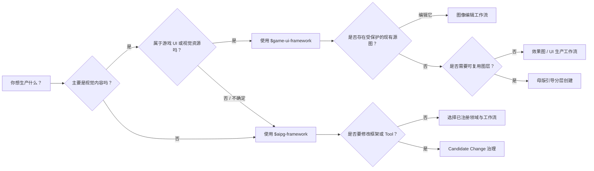

# AIPG 用户蓝图

> AIPG（AI Production & Governance Framework，AI 生产与治理框架）的详细使用地图  
> 文档版本：`1.1.0-beta.1`  
> 适用于：AIPG Core、GUIF 视觉生产、Codex Skills、Host/Tool 路由、Artifact 治理、版本管理、发布、恢复与导出

## 1. 如何阅读本蓝图

本文面向四类读者：

| 读者 | 建议从这里开始 | 主要关注点 |
| --- | --- | --- |
| 生产用户 | 第 2、3、11 节 | 应该提出什么请求，以及何时需要审批 |
| 美术或 UI 用户 | 第 5、8、11.2–11.4 节 | Theme、母版图、分层、视觉评审、导出 |
| 项目负责人 | 第 6、7、9、10 节 | Tool、隐私、证据、恢复、发布治理 |
| 框架开发者 | 第 4、6、9、12、13 节 | Domain Pack、Workflow v3、适配器、兼容性 |

名称是 **AIPG**，不是 AIGP：

- **AIPG**：领域无关的 AI 生产与治理框架。
- **GUIF**：AIPG 内的游戏 UI 与视觉生产领域。

## 2. 完整地图

```mermaid
flowchart TD
    U["用户意图"] --> H["Codex / ChatGPT Host"]
    H --> S{"Skill 路由"}
    S -->|框架级| AS["$aipg-framework"]
    S -->|游戏 UI / 视觉| GS["$game-ui-framework"]

    AS --> R["AIPG 领域与工作流路由器"]
    GS --> VD["GUIF 视觉生产领域"]
    R --> D{"已注册的 Domain Pack"}
    D --> FG["框架治理"]
    D --> VD
    D --> FD["未来领域：音频、文本、代码、视频、游戏内容"]

    FG --> CW["Candidate Change 工作流"]
    VD --> W{"视觉工作流"}
    W --> UI["UI 生产"]
    W --> EI["效果图"]
    W --> ED["图像编辑"]
    W --> MG["母版引导分层创建"]
    W --> RP["资源生产"]
    W --> QA["质量保证"]

    UI --> C["必需上下文"]
    EI --> C
    ED --> C
    MG --> C
    RP --> C
    C --> P["生产契约"]
    P --> A{"审批门"]
    A -->|已批准| TR["Tool 解析"]
    A -->|要求修改| P
    A -->|已拒绝| X["停止，且不修改生产状态"]

    TR --> TI["chatgpt-image"]
    TR --> DR["dry-run：仅用于契约测试"]
    TR --> IT["已注册的外部 Tool Adapter"]
    TI --> AR["真实 Artifact 注册"]
    IT --> AR
    DR --> SR["模拟回执；绝不是视觉结果"]

    AR --> MR["元数据评审"]
    MR --> VR["通过 chatgpt-vision 或已注册检查器进行语义视觉评审"]
    VR -->|通过| EG["导出门"]
    VR -->|发现问题| RV["限定范围的修订 + 新审批"]
    RV --> TR
    EG --> EA["Engine Adapter：generic / Unity / Godot / Unreal"]
    EA --> OUT["已导出的资源 + 清单 + 来源信息"]

    CW --> CP["候选提案"]
    CP --> CT["隔离候选版本"]
    CT --> CE["真实候选证据"]
    CE --> AD{"采纳决策"}
    AD -->|采纳| PUB["PR、CI、合并、发布"]
    AD -->|调整| CT
    AD -->|拒绝| ST["保留稳定版本"]
    PUB --> REF["刷新插件 + 新 Host 会话"]
    REF --> REG["正式回归"]
    REG --> RES["恢复暂停的生产"]
```

这张地图包含三条不可妥协的边界：

1. Skill 负责决策和治理，不得伪造 Tool 输出。
2. Tool 负责创建或检查真实结果；仅凭元数据不能证明语义质量。
3. 候选代码已经存在，并不代表它已经稳定；发布、刷新与回归仍是彼此独立的状态。

## 3. 面向用户的入口地图

用户通常只需要用自然语言描述目标，不应被迫管理 Task ID、租约、回调 ID、私有路径、凭据或底层运行命令。



### 推荐的自然语言入口请求

| 意图 | 示例请求 | 预期路由 |
| --- | --- | --- |
| 通用生产 | “使用 AIPG 规划并治理这项生产任务。” | `$aipg-framework` |
| 游戏 UI 创建 | “使用 GUIF 设计一个科幻商店界面。” | `$game-ui-framework` |
| 编辑现有图像 | “使用 GUIF 编辑这个已注册源图，但不要改变角色。” | GUIF 图像编辑 |
| 分层创建 | “以母版作为风格和布局指导，从底到顶创建资源。” | 母版引导分层创建 |
| Tool 集成 | “集成一个可生成可编辑 UI 结构的布局 Tool。” | AIPG Tool Integration Candidate |
| 框架演进 | “把这个工作流转化为可复用的领域工作流。” | AIPG Candidate Change |
| 导出 | “把已批准资源导出到 Unity。” | GUIF 导出门 + Unity 适配器 |

## 4. 职责模型

### 4.1 AIPG Core

AIPG Core 负责领域无关的治理：

- 意图与领域路由；
- Workflow 加载与验证；
- 任务状态与检查点；
- 审批门；
- Artifact 身份与血缘；
- 受保护 Source 策略；
- Tool 发现与路由；
- 确定性 QA 边界；
- 语义评审要求；
- 修订范围；
- Candidate Change；
- 采纳与发布记录；
- 恢复与受控导出。

AIPG Core **不需要**理解：按钮、面板、视觉层级、图像透明度或 Theme 语义；模型如何生成像素；Unity 如何导入 Sprite；音频、文本、代码或视频领域如何评价质量。

这些职责属于 Domain Pack、Tool、检查器和导出器。

### 4.2 Domain Pack

Domain Pack 定义特定生产领域的行为。

| 字段 | 含义 |
| --- | --- |
| Domain ID | 稳定的路由身份 |
| Workflows | 该领域注册的工作流 |
| Context types | Theme、母版、源图、需求或领域数据 |
| Artifact kinds | 领域专属输出类型 |
| Review criteria | 确定性评审与语义评审要检查的内容 |
| Tool capabilities | Tool Adapter 必须提供的能力 |
| Export adapters | 支持的交付目标 |
| Compatibility names | 迁移期间保留的旧名称 |

当前内置 Domain Pack：

| 领域 | 状态 | 工作流 |
| --- | --- | --- |
| `framework-governance` | 已实现 | 框架演进与 Candidate Change |
| `visual-production` | 已通过 GUIF 实现 | 规划、UI 生产、效果图、Theme 方向、资源、QA、母版引导分层 |
| 音频 | 未实现 | 需要未来的 Domain Pack |
| 文本 / 叙事 | 未实现 | 需要未来的 Domain Pack |
| 代码生产 | 未实现 | 需要未来的 Domain Pack |
| 视频 | 未实现 | 需要未来的 Domain Pack |
| 游戏内容 | 未实现 | 需要未来的 Domain Pack |

“未来领域”表示架构允许，但当前不可用。

### 4.3 Workflow

Workflow 是声明式生产路线，决定：必需上下文、阶段顺序、参与 Agent、审批点、约束策略、能力要求、评审要求、修订行为与导出前置条件。

Workflow Manifest v3 字段：

| 字段 | 必需 | 用途 |
| --- | --- | --- |
| `schema_version` | 是 | Manifest 契约版本 |
| `id` | 是 | 稳定工作流身份 |
| `name` | 是 | 人类可读名称 |
| `domain` | 是 | 所属 Domain Pack |
| `manager` | 是 | 协调角色 |
| `agents` | 是 | 执行 Agent 顺序 |
| `steps` | 是 | 人类可读生产步骤 |
| `requires` | 是 | 必需上下文类型 |
| `stages` | 是 | 受治理的生命周期阶段 |
| `creation_direction` | 是 | 有序或无序生产 |
| `constraint_policy` | 是 | 硬约束 / 软约束语义 |

为兼容性，Schema v1 和 v2 仍可读取。

### 4.4 Skill

Skill 是 Codex 使用的自然语言操作策略。它负责：识别用户意图、选择 Domain 与 Workflow、把用户语言转换为受治理契约、呈现审批决策、调用框架内部操作、在获准时调用真实 Host 能力，以及只报告安全的用户可见状态。

Skill 不得：

- 伪造 Tool 结果；
- 隐藏必需的源图注册选择；
- 声称 dry run 生成了真实媒体；
- 暴露私有运行标识或路径；
- 把元数据当作语义评审；
- 在缺少采纳状态时合并或发布候选版本。

### 4.5 Host

Host 是当前的操作环境。现阶段默认 Host 为 ChatGPT / Codex。

Host 负责理解自然语言意图、访问已配置能力、执行真实 Tool 交接、返回真实文件或结构化发现、将凭据和私有附件留在 Project Git 之外，并且绝不能声称不可用的能力已经成功运行。

### 4.6 Tool

Tool 执行具体能力。Tool 身份与能力是不同概念：

- `chatgpt-image` 是 Tool 身份。
- `image-generation`、`image-editing`、`transparent-output` 是能力。

一个 Tool 可以提供多项能力；一个 Workflow 也可能要求多项能力。

### 4.7 Artifact

Artifact 是带有身份和血缘的已注册结果。注册不等于批准。

```text
返回真实文件
-> 已注册
-> 已完成元数据评审
-> 等待语义评审
-> 通过或存在问题
-> 活跃或已被替代
-> 可导出或被阻止
```

### 4.8 Engine Adapter

Engine Adapter 将已批准的生产资源转换为交付目标。它不是图像生成 Tool。

当前适配器：`generic`、`unity`、`godot`、`unreal`。

## 5. Skill 地图

### 5.1 `$aipg-framework`

用于领域无关路由、新 Domain Pack 创建或注册、Workflow v3 注册、视觉细节之外的生产治理、Candidate Change、Tool 集成、Provider 路由、版本迁移，以及发布、刷新、回归和恢复。

当某个领域已经存在专门生产规则时，不应使用它代替对应领域 Skill。

### 5.2 `$game-ui-framework`

用于游戏 UI 与视觉界面生产、私有 Theme 生命周期、母版和 Source 注册、图像生成与编辑、受保护区域编辑、效果图、母版引导分层、视觉 QA、修订和游戏引擎资源导出。

它既是 GUIF 的兼容入口，也是 AIPG 的视觉生产 Skill。

### 5.3 Skill 选择优先级

| 场景 | 主 Skill | 次级行为 |
| --- | --- | --- |
| 通用或未知领域 | `$aipg-framework` | 路由到已注册 Domain Pack |
| 游戏 UI 请求 | `$game-ui-framework` | 底层使用 AIPG 治理 |
| 视觉工作流缺陷 | `$game-ui-framework` | 打开 AIPG Candidate Change |
| 框架级缺陷 | `$aipg-framework` | 诊断受影响层 |
| 新视觉布局 Tool | `$aipg-framework` + GUIF 上下文 | 仅集成所需能力 |
| 现有 GUIF 项目 | `$game-ui-framework` | 保持兼容契约 |

### 5.4 添加未来 Skill

新的 Domain Skill 必须声明：触发条件、Domain Pack ID、支持的 Workflows、必需上下文、审批行为、Tool 能力映射、真实完成标准、隐私规则、Artifact 与血缘策略、修订与导出策略、Candidate Change 行为，以及公开的虚构回归夹具。

## 6. Tool 与能力地图

### 6.1 当前已注册生产 Tool

| Tool | 能力 | 执行方式 | 可用于生产 | 外部调用 | 凭据 |
| --- | --- | --- | --- | --- | --- |
| `chatgpt-image` | 图像生成、图像编辑、受保护区域编辑、透明输出 | Host 外部回调 | 允许 | 是 | 使用 Host 支持；无需单独框架凭据 |
| `dry-run` | 图像任务的确定性契约模拟 | 直接执行 | 不可视为真实生产 | 否 | 无 |

### 6.2 当前语义检查器

| 检查器 | 能力 | 结果 |
| --- | --- | --- |
| `chatgpt-vision` | 通过 Host 提交执行真实语义视觉检查 | 结构化状态、摘要与问题 |

检查结果必须来自对真实 Artifact 的检查。文件名、MIME 类型、宽高或校验和都不能证明构图、可读性、Theme 一致性、可用性或视觉质量。

### 6.3 Tool 解析顺序

```text
显式指定
> Task
> Project
> Workspace
> 框架默认值
```

候选 Tool 试用只能使用 Task 级覆盖，不得静默修改 Project 或 Workspace 路由。

### 6.4 Tool 就绪信息披露

采用不熟悉的 Tool 前，用户应看到：注册状态、可用性、健康状态、必需能力、支持的 Host、权限、输入输出数据范围、外部调用、已知计费状态、凭据要求、失败与重试行为，以及采纳范围。

### 6.5 Tool 不可用时

合法结果只有三种：

1. 绑定另一个已注册且健康的 Tool。
2. 打开 Tool Integration Candidate 并构建 Adapter。
3. 取消该生产步骤。

“假装 Tool 已经运行”永远不是合法结果。

### 6.6 Tool Adapter 契约

生产级 Tool Adapter 需要：稳定的 Tool ID 与版本、能力清单、权限和数据范围、Host 支持声明、健康检查、执行模式、真实结果回调或直接结果契约、Artifact 注册、失败恢复、契约测试、允许生产的策略，以及真实的模拟标记。

### 6.7 图像 Tool 与布局 Tool

| 需求 | 合适能力 |
| --- | --- |
| 绘制背景或插画 | 光栅图像生成 |
| 像素级编辑 | 图像编辑 |
| 透明图层资源 | 透明图像输出 |
| 结构化 UI 层级 | 结构化布局 Tool |
| 可编辑组件库 | 设计系统 / 组件 Tool |
| 视觉语义判断 | 视觉检查器 |
| Unity 导入与层级 | Engine Adapter |

选择结构化布局 Tool 不应自动替换光栅图像生成。

## 7. 数据、隐私与血缘地图

### 存储规则

| 数据 | 默认存储位置 | 允许进入公开 Git？ |
| --- | --- | --- |
| 框架源码与公开文档 | Framework Git | 是 |
| 虚构测试和夹具 | Framework Git | 是 |
| 真实 Theme 内容 | 私有框架数据 | 否 |
| 上传或会话图像 | 私有 Source Library | 否 |
| Prompt 与决策 | 私有框架数据 | 否 |
| 凭据和 Token | 私有框架数据 | 否 |
| 候选证据 | 私有框架数据 | 否 |
| 导出的项目资源 | 用户选择的 Project 位置 | 仅在明确选择后 |
| 公开回归图像 | Framework Git | 仅限完全虚构内容 |

### Source 角色

| Source 用途 | 含义 |
| --- | --- |
| `editable-source` | 已授权用于受保护编辑的源图 |
| `theme-reference` | 视觉方向参考 |
| `master-reference` | 构图与风格的母版指导 |

未注册图像不得静默成为 GUIF 的受保护编辑源。

每个真实 Artifact 都应标识：来源 Task 与 job、Tool 与可用时的模型身份、输入引用、输出契约、审批快照、文件身份、模拟与视觉标志、QA 状态、替代关系与导出关系。

## 8. GUIF 视觉工作流地图

### 8.1 标准 UI 生产

```text
Theme / 上下文
-> 需求
-> 结构化计划
-> 美术方向
-> 资源契约
-> 模型无关 Prompt IR
-> 审批
-> 真实图像生产
-> 元数据 + 语义评审
-> 必要时修订
-> 导出
```

适用于目标为界面或视觉资源集，但不要求母版引导、自底向上生产的情况。

### 8.2 现有图像编辑

```text
真实图像
-> 源图注册决策
-> 注册 editable-source
-> 受保护编辑契约
-> 编辑审批
-> 真实图像编辑
-> 受保护像素检查
-> 语义评审
-> 替换 / supersession
```

首次生成审批不授权后续编辑。每次修订都需要独立审批。

### 8.3 母版引导分层创建

母版策略：

```json
{
  "role": "style-and-layout-guidance",
  "pixel_matching": false,
  "layout_anchors": "preserve",
  "style_intent": "preserve",
  "creative_interpretation": "allowed"
}
```

硬约束包括：功能角色、主要布局锚点、独立资源边界、必需文字或信息、受保护内容、透明度和画布契约、交互状态要求。

软指导包括：形状细节、材质、纹理、光照、装饰、局部颜色解释，以及对已完成图层的视觉响应。

| 创作自由度 | 典型图层 |
| --- | --- |
| 低 | 品牌标记、关键控制、重要信息 |
| 中 | 面板、边框、图标、次级控制 |
| 高 | 背景、氛围、装饰效果、前景粒子 |

修订第 N 层时：保留 N 以下已批准的受保护层；使第 N 层失效；使下游合成与依赖层失效；要求新的语义评审；且不授权无关编辑。

### 8.4 视觉保证阶梯

| 层级 | 可以证明 | 不能证明 |
| --- | --- | --- |
| 文件验证 | 文件存在、格式可读 | 视觉正确性 |
| 元数据 QA | 尺寸、MIME、透明声明、命名 | 构图或质量 |
| 像素 QA | 受保护像素在容差内未改变 | Theme 或可用性 |
| 契约 QA | 必需结构字段和审批存在 | 实际模型输出质量 |
| 语义视觉评审 | 构图、可读性、Theme 一致性、视觉问题 | 未经用户确认的主观偏好 |
| 用户审批 | 主观接受与授权 | 从未发生过的 Tool 执行 |

## 9. 审批与治理地图

### 9.1 生产审批

| 审批门 | 授权内容 | 不授权内容 |
| --- | --- | --- |
| 计划审批 | 执行已批准的初始计划 | 未来修订 |
| 图层计划审批 | 按顺序执行已列出的图层 | 未列出资源或重大布局改动 |
| 修订审批 | 应用指定范围的编辑 | 其他图层或受保护区域 |
| 最终视觉审批 | 标记评审后的构图可接受 | 导出到所有目标 |
| 导出审批 / 请求 | 为指定目标实体化已批准资源 | 框架发布 |

### 9.2 Candidate Change 审批

```text
提案
-> 候选构建授权
-> 隔离实现
-> 真实证据
-> 采纳决策
-> 发布
```

| 决策 | 含义 |
| --- | --- |
| 构建候选 | 可在隔离环境中实现并验证 |
| 要求修改 | 返回候选构建 |
| 拒绝候选 | 保留稳定系统 |
| 采纳候选 | 授权进入发布工作流 |

只有在真实候选证据存在后，采纳才有效。

### 9.3 变更分类

| 变更类型 | 使用场景 |
| --- | --- |
| `skill-change` | 自然语言操作策略错误或不完整 |
| `framework-change` | 核心领域无关行为需要改变 |
| `workflow-change` | 阶段顺序、审批门或必需上下文需要改变 |
| `multi-layer-change` | 多个框架层同时变化 |
| `theme-policy-change` | Theme 存储、绑定或应用规则变化 |
| `provider-routing-change` | 旧版 / Provider 选择行为变化 |
| `tool-change` | 切换到已注册且可用的 Tool |
| `tool-integration-change` | 新 Tool 或不受支持 Tool 需要 Adapter |

选择类型前，应先诊断所有受影响层。

## 10. 版本治理

AIPG 存在多个版本轴，不能压缩成一个数字。

| 版本 | 示例 | 管理对象 |
| --- | --- | --- |
| Plugin version | `1.1.0-beta.1` | 已安装 Codex 插件快照 |
| Candidate plugin version | `1.2.0-candidate.1` | 隔离的采纳前构建 |
| Python package version | `1.1.0b1` | `aipg-framework` 分发包 |
| Public API version | `1` | 兼容性表面 |
| Workflow schema | `3` | Workflow manifest 结构 |
| Artifact schema | `1` | Artifact 记录结构 |
| Task schema | `2`, `3` | 持久化 Task 兼容性 |
| Theme version | 不可变整数版本 | 用户拥有的 Theme 演进 |
| Tool manifest version | 如 `1.0` | Adapter 能力声明 |
| Domain Pack schema | `1` | Domain 注册契约 |

### 10.2 语义化版本策略

| 变更 | 版本影响 |
| --- | --- |
| 仅文档澄清 | Patch 或无需运行时版本变化 |
| 向后兼容的 Workflow / Tool 能力 | Minor |
| 新 Domain Pack | Minor |
| 新的可选 Workflow v3 | Minor |
| 不改变契约的 Bug 修复 | Patch |
| 插件打包修正 | Patch |
| 破坏性 Public API 或持久化 Schema 变更 | Major 或新的 Public API 版本 |
| 候选迭代 | 采纳前只使用 candidate 后缀 |

预发布标识不能让破坏性变更自动变得安全；兼容性仍需要明确迁移路径。

### 10.3 兼容性规则

AIPG 1.x 当前保留：`guif` Python import、`guif` CLI 别名、`$game-ui-framework`、现有 GUIF 私有数据环境变量、Workflow schema v1 和 v2、声明支持范围内的 Theme / Source / Artifact / Task / Candidate 记录，以及显式 Legacy ProviderAdapter 兼容性。

新的领域无关集成应使用 `aipg`；视觉集成可以使用 `guif`。

### 10.4 发布治理

```text
问题 / 目标变更
-> 私有 Improvement Case
-> 候选分支
-> 实现 + 文档 + 迁移
-> 单元、契约、回归、构建、安装测试
-> 记录真实候选证据
-> 用户采纳决策
-> 推送候选分支
-> 打开 PR
-> 必需 CI 与评审
-> 合并到受保护 main
-> 版本 / Tag / Package 发布
-> 记录仓库、PR、合并提交、最低插件版本
-> 用户刷新插件
-> 启动新 Codex 会话
-> 重放正式回归
-> 恢复生产
```

发布的框架变更应记录：仓库、分支、PR、合并提交、发布版本、最低插件版本、构建与测试结果、迁移说明、刷新要求和正式回归结果。

修改发布版本或身份时，应检查 `.codex-plugin/plugin.json`、市场元数据、`pyproject.toml`、`aipg` 与 `guif` 版本暴露、CI 版本断言、README 与中文 README、CHANGELOG、候选 / 发布说明、架构和迁移文档、插件 Skills、包来源预期，以及断言插件 / 包身份的测试。

历史发布说明应保持历史准确，不应机械重写。

## 11. 端到端用户旅程

### 11.1 通用受治理生产

1. 用户描述目标。
2. `$aipg-framework` 识别 Domain。
3. AIPG 选择或请求 Workflow。
4. Workflow 声明必需上下文。
5. 请求缺失上下文，但不暴露运行时内部信息。
6. 呈现生产契约。
7. 用户批准、要求修改或拒绝。
8. Tool 解析验证能力和健康状态。
9. 真实结果注册为 Artifact。
10. 在正确的保证层级执行评审。
11. 修订获得独立审批。
12. 只有导出门通过后才能导出。

### 11.2 创建一张游戏 UI 效果图

建议请求：

> 使用 GUIF 创建一个虚构的科幻背包界面。生成前先确认 Theme 和计划。

预期路由：

```text
$game-ui-framework
-> visual-production
-> effect-image 或 ui-production
-> Theme
-> 计划审批
-> chatgpt-image
-> Artifact
-> chatgpt-vision
-> 最终审批
-> 可选导出
```

### 11.3 创建分层游戏 UI

建议请求：

> 使用已批准母版作为风格与布局指导。分析粗粒度图层，让 AI 创造性解释软细节，然后从背景到前景生产并导出独立资源。

预期路由：

```text
$game-ui-framework
-> master-guided-layer-creation
-> Theme + master-reference
-> 母版审批
-> 图层计划审批
-> 背景
-> 当前合成
-> 容器 / 边框
-> 当前合成
-> 控件 / 内容
-> 当前合成
-> 装饰 / 效果
-> 最终语义评审
-> 图层清单 + 引擎导出
```

### 11.4 安全编辑现有图像

1. GUIF 检查图像是否已注册。
2. 如果未注册，用户选择：editable source、Theme reference、master reference，或离开正式链路。
3. editable-source 注册创建不可变血缘。
4. 编辑计划标记受保护区域。
5. 用户批准编辑。
6. 执行真实编辑。
7. 检查受保护像素与语义质量。
8. 通过的替换结果可 supersede 原 Source。

### 11.5 添加新 Tool

建议请求：

> 为 GUIF 组件层级添加结构化布局 Tool，但继续使用当前图像 Tool 进行光栅生成。

```text
$aipg-framework
-> 能力分析
-> Tool 发现
-> 已注册且健康？
   -> 是：Task 级 Tool 试用
   -> 否：Tool Integration Candidate
-> 权限 / 数据 / 计费 / 凭据披露
-> Adapter 契约
-> 真实结果
-> 采纳范围
```

### 11.6 改进 AIPG 本身

识别实际与预期行为；诊断 Skill、Workflow、Core、Tool、Theme 策略、Prompt IR、评审与导出层；打开一个 Improvement Case；保存生产检查点；在隔离源码分支构建；使用虚构公开夹具；运行真实测试并记录证据；采纳、调整或拒绝；采纳后通过 PR 和 CI 发布；刷新插件并执行正式回归。

## 12. 恢复与失败地图

| 失败 | 用户可见结果 | 正确恢复方式 |
| --- | --- | --- |
| GUIF 缺少必需 Theme | Theme 确认 | 选择、创建、派生，或在允许时明确继续不绑定 |
| 缺少已注册 Source | 需要导入 Source | 用户选择 Source 用途 |
| Tool 未注册 | 等待 Tool | 绑定、集成或取消 |
| Tool 不健康 | 等待 Tool | 重试健康检查、选择其他 Tool 或集成 |
| 外部回调中断 | 可恢复错误 | 恢复或重试持久化工作 |
| 语义评审发现问题 | 需要修订 | 创建限定范围修订并单独审批 |
| 候选失败 | 候选构建中 | 调整候选；稳定版本保持不变 |
| 插件已发布但仍是旧会话 | 需要刷新插件 | 刷新插件并启动新会话 |
| 正式回归失败 | 重新打开候选 | 修复并重新发布；不得恢复生产 |
| 导出门被阻止 | 拒绝导出 | 解决审批、QA、血缘或缺失 Artifact |

恢复必须使用持久化检查点，不得编造已完成工作，也不得盲目重复外部操作。

## 13. 扩展蓝图

### 13.1 添加 Domain Pack

必需交付物：稳定 Domain ID、Domain Pack schema、面向用户的 Skill 或路由规则、Workflow manifest、领域上下文 schema、Artifact 类型、Tool 能力与适配器、确定性 QA、语义检查器契约、修订策略、导出器、隐私策略、虚构夹具、迁移与版本说明、失败恢复测试。

### 13.2 添加 Workflow

1. 确定 Domain 所属。
2. 定义用户意图与非目标。
3. 定义必需上下文。
4. 定义有序阶段。
5. 定义硬约束与软约束。
6. 定义审批门。
7. 定义 Tool 能力。
8. 定义 Artifact 输出。
9. 定义确定性评审与语义评审。
10. 定义修订失效规则。
11. 定义导出前置条件。
12. 添加 Workflow v3 manifest。
13. 添加虚构测试。
14. 更新 Domain registry、README、CHANGELOG 与迁移说明。

### 13.3 添加 Engine Adapter

Engine Adapter 应只接受可导出的 Artifact；保留 Artifact 与 manifest 身份；在支持范围内映射尺寸、透明度、Pivot、切片、层级、状态、材质和目标设置；准确报告写入内容；安全失败且不谎称引擎导入成功；支持回滚或明确说明不可回滚边界。

### 13.4 添加检查器

检查器契约需要：稳定身份、支持的媒体与标准、权限和数据范围披露、真实 Artifact 附件、结构化状态 / 摘要 / 问题、禁止仅凭元数据给出语义通过、重试与失败行为，以及使用虚构媒体的测试。

## 14. 操作检查清单

### 生产前

- [ ] 已选择正确 Domain 与 Workflow。
- [ ] 必需上下文已具备。
- [ ] 真实 Source 用途已注册。
- [ ] Tool 能力可用且健康。
- [ ] 已理解权限、数据流、凭据和计费。
- [ ] 生产契约完整。
- [ ] 已记录必需审批。

### 接受 Artifact 前

- [ ] 结果文件真实且已注册。
- [ ] Tool 与模型身份真实。
- [ ] 生产结果的 simulation 标志为 false。
- [ ] 引用和血缘有效。
- [ ] 元数据 QA 通过。
- [ ] 适用时受保护像素 QA 通过。
- [ ] 语义评审使用了真实 Artifact。
- [ ] 必要时用户已确认主观接受。

### 导出前

- [ ] 活跃 Artifact 已获批准。
- [ ] 没有阻断性的视觉问题。
- [ ] 必需图层依赖完整。
- [ ] 构图 manifest 有效。
- [ ] 目标 Engine Adapter 受支持。
- [ ] 导出目标与覆盖策略明确。
- [ ] 已理解回滚边界。

### 采纳框架变更前

- [ ] 在可行时记录稳定基线。
- [ ] 候选分支与版本已关联。
- [ ] 已记录真实候选证据。
- [ ] 用户私有数据未进入公开 Git。
- [ ] 已评估向后兼容性。
- [ ] README、CHANGELOG、迁移、manifest 与测试已更新。
- [ ] 用户已查看候选结果。
- [ ] 采纳决策明确。

### 发布前

- [ ] 采纳状态授权发布。
- [ ] 分支已推送。
- [ ] PR 已打开并包含迁移与证据摘要。
- [ ] 必需 CI 通过。
- [ ] 评审问题已解决。
- [ ] main 受保护，禁止未经评审的变更。
- [ ] 各文件中的发布版本一致。
- [ ] 已记录仓库、PR、合并提交与最低插件版本。
- [ ] 已说明插件刷新和新会话要求。
- [ ] 正式回归计划已就绪。

## 15. 快速参考矩阵

| 用户请求 | Skill | Domain | Workflow / 流程 | 主要 Tool 或适配器 | 关键审批门 |
| --- | --- | --- | --- | --- | --- |
| 通用 AI 生产 | `$aipg-framework` | 路由决定 | 已注册 Workflow | 取决于能力 | 计划审批 |
| 游戏 UI 设计 | `$game-ui-framework` | 视觉 | UI production | `chatgpt-image` | 生产审批 |
| 单张效果图 | `$game-ui-framework` | 视觉 | Effect image | `chatgpt-image` | 视觉评审 |
| 受保护图像编辑 | `$game-ui-framework` | 视觉 | Image editing | `chatgpt-image` | Source + 修订审批 |
| 分层 UI 资源 | `$game-ui-framework` | 视觉 | Master-guided layers | `chatgpt-image` + 检查器 | 图层计划 + 最终审批 |
| 视觉检查 | `$game-ui-framework` | 视觉 | QA | `chatgpt-vision` | 必须有真实 Artifact |
| Unity 输出 | `$game-ui-framework` | 视觉 | Export | Unity Engine Adapter | 导出门 |
| 仅契约测试 | 开发者 / 操作者 | 任意受支持领域 | 现有 Workflow | `dry-run` | 绝不能视为生产 |
| 修改 Tool 路由 | `$aipg-framework` | 治理 | Tool Change | 已注册 Tool | 证据 + 采纳范围 |
| 集成新 Tool | `$aipg-framework` | 治理 | Tool Integration Candidate | 新 Adapter | 采纳 |
| 修改框架 | `$aipg-framework` | 治理 | Candidate Change | 源码仓库 | 采纳 + 发布 |

## 16. 黄金规则

1. 在请求领域专属上下文前，先按 Domain 与 Workflow 路由。
2. Theme 属于 GUIF，而不是 AIPG 顶层。
3. Skill 负责治理；Tool 负责执行；Artifact 负责记录；评审负责判断。
4. Tool 身份不等于能力。
5. Dry run 永远不是真实媒体结果。
6. 元数据永远不等于语义评审。
7. 每次修订都有独立范围和审批。
8. 真实 Source 与证据默认保持私有。
9. 候选版本不得改变稳定生产。
10. 采纳、发布、插件刷新与正式回归是彼此独立的状态。
11. 向后兼容需要明确契约与迁移方案。
12. 如果能力不可用，应如实停止或完成集成，绝不能伪造成功。
